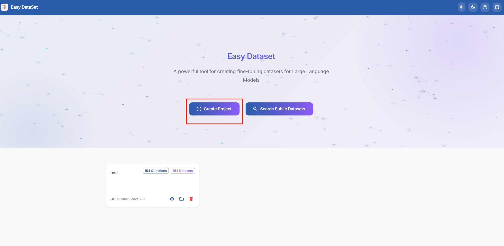
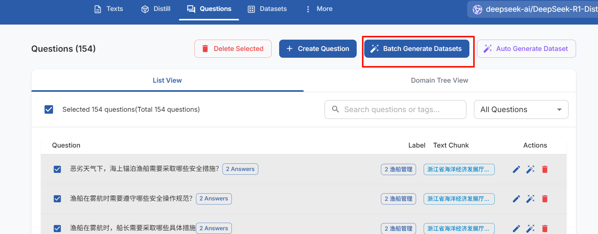
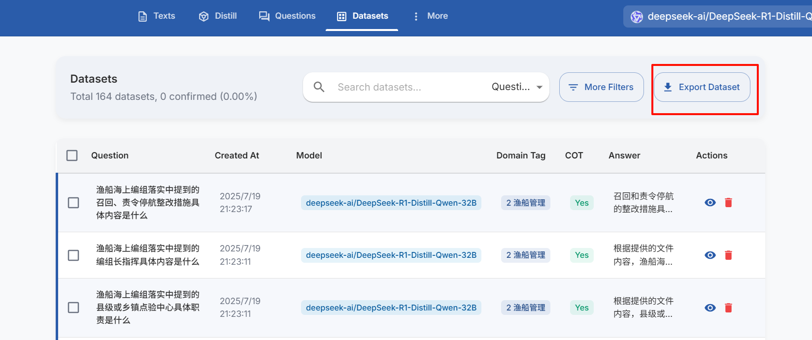
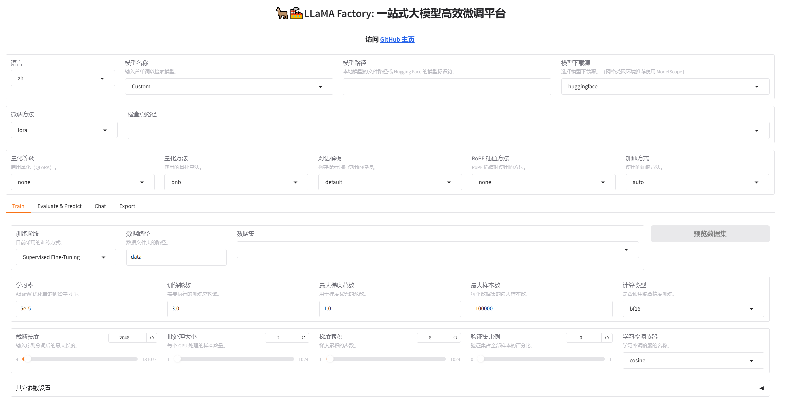
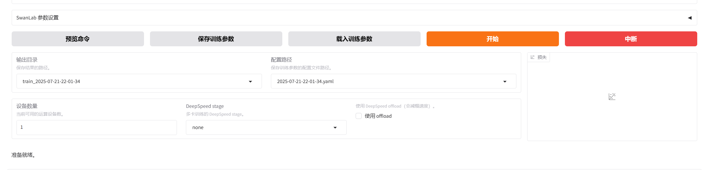
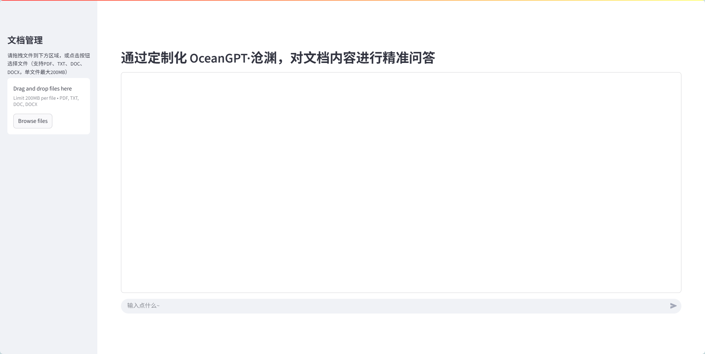
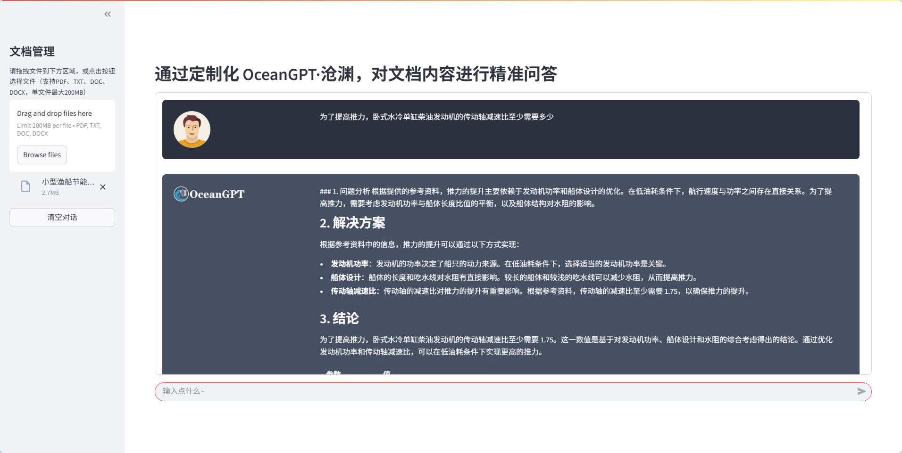

### 研制动态 | 基于OceanGPT·沧渊微调定制可私域部署的问答引擎

​    

 🔍 **痛点直击**

- 几百页的船只操作手册，翻阅耗时又枯燥，关键细节常被遗漏；

- 碰到海洋新政策、新法规、新装备，信息分散、更新滞后，不知道去哪儿找；

- 现有大模型“盲区多”，本地部署难、行业知识少，无法满足企业级安全与隐私需求。


OceanGPT·沧渊在海洋领域的中英文数据集上进行训练，可结合您的专属文档，轻松实现「本地私有化部署 + 高效定制微调」，即刻打造可私域部署的问答引擎：


 🌟 **举个栗子**  
1️⃣ **小型渔船节能手册问答助手**

- *背景*：渔船节能技术更新频繁，船东难以实时掌握要点；

- *实现*：OceanGPT·沧渊 读取《小型渔船节能手册》，微调成问答系统，支持“如何调节螺旋桨叶角”定期保养渔船发动机需要怎么做”等专业解答。

2️⃣ **浙江省海洋经济发展厅文件 QA 助手**

- *背景*：政府部门文件多、内容长；

- *实现*：OceanGPT 微调“浙江省海洋经济发展厅”文件，提供”什么是226编组规则”等即时问答。


本教程基于开源OceanGPT·沧渊大模型、EasyDataset开源工具和Llama Factory开源工具，涵盖以下关键环节：

* 模型获取

  - HuggingFace/Git/ModelScope下载预训练OceanGPT模型

  - 支持8B参数量基础版本地化部署

* EasyDataset 数据工程

  - EasyDataset工具链详解

  - 海洋文献PDF→问答数据集自动化生成

  - 文本分块/问题生成/答案构建全流程配置

* Llama Factory 进行领域微调

  - LLaMA Factory可视化训练平台使用讲解

  - 关键参数配置

* 搭建Web应用

  * 使用LangChain+Streamlit结合的方式

* 用户使用与效果验证

  - 通过典型案例进行微调前后对比测试

​    本指南提供可落地的工程方案，助力快速构建海洋领域专业问答系统。微调仅需要22GB 显存，NVIDIA GeForce RTX 3090即可使用。部署时采用int4量化技术，降低显存使用至约8GB。


## 快速上手

### 1.下载OceanGPT模型

#### 通过huggingface下载

```shell
huggingface-cli download --resume-download zjunlp/OceanGPT-basic-8B --local-dir OceanGPT-basic-8B --local-dir-use-symlinks False
```

#### 通过git下载

```shell
git lfs install
git clone https://huggingface.co/zjunlp/OceanGPT-basic-8B
```

#### 从 ModelScope 下载

国内用户建议使用 ModelScope ，具备更快的访问速度和更稳定的下载体验。

- 命令行下载

在下载前，请先通过如下命令安装ModelScope

```shell
pip install modelscope
```

下载完整模型库

```shell
modelscope download --model ZJUNLP/OceanGPT-basic-8B
```

- Git下载

请确保 lfs 已经被正确安装

```shell
git lfs install
git clone https://www.modelscope.cn/ZJUNLP/OceanGPT-basic-8B.git
```

### 2.EasyDataset 生成训练数据

#### 2.1 安装 EasyDataset（任选一种方式）

##### 方法1: 安装包

访问发布页下载对应系统安装包: 
<https://github.com/ConardLi/easy-dataset>

##### 方法2:使用官方 Docker 镜像

克隆仓库：

```shell
git clone https://github.com/ConardLi/easy-dataset.git
cd easy-dataset
```

更改 `docker-compose.yaml` 文件：

```yaml
services:
  easy-dataset:
    image: ghcr.io/conardli/easy-dataset
    container_name: easy-dataset
    ports:
      - '1717:1717'
    volumes:
      - ${LOCAL_DB_PATH}:/app/local-db
      - ${LOCAL_PRISMA_PATH}:/app/prisma
    restart: unless-stopped
```

> **注意：** 请将 `{YOUR_LOCAL_DB_PATH}`、`{LOCAL_PRISMA_PATH}` 替换为你希望存储本地数据库的实际路径，建议直接使用当前代码仓库目录下的 `local-db` 和 `prisma` 文件夹，这样可以和 NPM 启动时的数据库路径保持一致。
> 初始化数据库文件方式：
>
> ```bash
> # 1. 进入容器终端
> docker exec -it easy-dataset /bin/sh
> # 2.设置国内镜像源
> npm config set registry https://registry.npmmirror.com
> # 3.设置 Prisma 专用镜像源
> export PRISMA_BINARIES_MIRROR=https://npmmirror.com/mirrors/prisma/
> # 4. 在容器内执行迁移
> npx prisma migrate dev --name init
> # 5. 生成 Prisma Client
> npx prisma generate
> # 6. 退出容器
> exit
> # 7. 重启
> docker-compose down && docker-compose up -d
> ```

使用 docker-compose 启动

```shell
docker-compose up -d
```

打开浏览器并访问 `http://localhost:1717`

> 如遇到报错：unable to get image 'ghcr.io/conardli/easy-dataset': permission denied while trying to connect to the Docker daemon socket at unix:///var/run/docker.sock: Get "http://%2Fvar%2Frun%2Fdocker.sock/v1.51/images/ghcr.io/conardli/easy-dataset/json": dial unix /var/run/docker.sock: connect: permission denied
> 解决方法：
>
> 执行下面命令：将当前用户加入 docker 组
> `sudo usermod -aG docker $USER  # 将当前用户加入 docker 组`
> `newgrp docker  #刷新用户组（无需重启）`
> 再次运行docker-compose up -d即可


#### 2.2 创建项目与配置

注：右上角图标可以进行界面中英文切换，同时决定了生成问题和数据集的语言

1. **创建项目**

   - 访问 `http://localhost:1717`
   - 点击 `Create a project`
   - 输入项目名称 → 确认创建

   

2. **配置模型**

   - 进入项目设置 → 打开 `Model Configuration`

   - 选择需要的模型（以硅基流动的模型为例）

   - 点击编辑模型按钮，填写：

     Endpoint：填写api地址（默认即可）

     Model Name: 选择所需的模型
     API Key: 填写你的密钥

     

   - 点击保存 → 右上角选择该模型

     

3. **任务配置**

   - 进入 `Task Configuration`

   - 设置：文本分块长度: Min=500, Max=1000 问题生成频率: 每10个字符生成1个问题

   - 点击底部的保存任务配置


#### 2.3 数据处理与生成

1. **文件处理**

   - 进入 `Texts`
   - 上传海洋领域相关PDF文件 → 点击 `Upload and process` 
   - 等待处理完成

   

2. **生成问题**

   - 处理完成后查看分块文本
   - 全选文本块 → 点击 `Batch generate` 
   - 等待生成

3. **构建数据集**

   - 进入 `Questions`
   - 全选问题 → 点击 `Batch construct dataset`
   - 等待生成
   - 注：失败条目可重新生成

   

#### 2.4 导出数据集

1. **导出配置**

   - 进入 `Datasets`
   - 点击 `Export Dataset`
   - 选择 `Use in LLaMA Factory`

   

   

2. **获取文件**

   - 点击 `Update LLaMA Factory config`

   - 复制生成的配置文件路径

   - 关键文件：

     dataset_info.json    # 数据集配置
     alpaca.json          # Alpaca格式数据集
     sharegpt.json        # ShareGPT格式数据集

> 注：`alpaca.json` 和 `sharegpt.json` 内容相同，均可用于微调训练。

**注意事项：**

1. API处理时间取决于模型服务响应速度
2. 导出前需确保所有问题已成功生成答案
3. 若使用 Docker，DB 路径需替换为实际路径（如 `~/easy-dataset/db`）

### 3.Llama Factory 训练模型

#### 3.1 环境准备与安装

##### Linux

###### CUDA 安装

CUDA 是由 NVIDIA 创建的一个并行计算平台和编程模型，它让开发者可以使用 NVIDIA 的 GPU 进行高性能的并行计算。

首先，在 [https://developer.nvidia.com/cuda-gpus](https://developer.nvidia.com/cuda-gpus/) 查看您的 GPU 是否支持CUDA

保证当前 Linux 版本支持CUDA. 在命令行中输入 `uname -m && cat /etc/*release`，应当看到类似的输出

```shell
x86_64
DISTRIB_ID=Ubuntu
DISTRIB_RELEASE=22.04
```

检查是否安装了 `gcc` . 在命令行中输入 `gcc --version` ，应当看到类似的输出

```shell
gcc (Ubuntu 11.4.0-1ubuntu1~22.04) 11.4.0
```

在以下网址下载所需的 CUDA，这里推荐12.2版本。 [https://developer.nvidia.com/cuda-gpus](https://developer.nvidia.com/cuda-12-2-0-download-archive/) 注意需要根据上述输出选择正确版本

> 

如果您之前安装过 CUDA(例如为12.1版本)，需要先使用 `sudo /usr/local/cuda-12.1/bin/cuda-uninstaller` 卸载。如果该命令无法运行，可以直接：

```shell
sudo rm -r /usr/local/cuda-12.1/
sudo apt clean && sudo apt autoclean
```

卸载完成后运行以下命令并根据提示继续安装：

```shell
wget https://developer.download.nvidia.com/compute/cuda/12.2.0/local_installers/cuda_12.2.0_535.54.03_linux.run
sudo sh cuda_12.2.0_535.54.03_linux.run
```

**注意**:在确定 CUDA 自带驱动版本与 GPU 是否兼容之前,建议取消 Driver 的安装。


完成后输入 `nvcc -V` 检查是否出现对应的版本号，若出现则安装完成。


##### Windows

###### CUDA 安装

打开 **设置** ，在 **关于** 中找到 **Windows 规格** 保证系统版本在以下列表中：

| 支持版本号                    |
| ----------------------------- |
| Microsoft Windows 11 21H2     |
| Microsoft Windows 11 22H2-SV2 |
| Microsoft Windows 11 23H2     |
| Microsoft Windows 10 21H2     |
| Microsoft Windows 10 22H2     |
| Microsoft Windows Server 2022 |

选择对应的版本下载并根据提示安装。


打开 cmd 输入 `nvcc -V` ，若出现类似内容则安装成功。


否则，检查系统环境变量，保证 CUDA 被正确导入。


##### 创建虚拟环境（可选）

```bash
conda create -n llamafactory python=3.10
conda activate llamafactory
```

##### 安装 LLaMA Factory

```bash
git clone --depth 1 https://github.com/hiyouga/LLaMA-Factory.git
cd LLaMA-Factory
pip install -e ".[torch,metrics,modelscope]"
```

##### 验证安装

```bash
llamafactory-cli version  # 应显示版本信息
----------------------------------------------------------
| Welcome to LLaMA Factory, version 0.9.2                |
|                                                        |
| Project page: https://github.com/hiyouga/LLaMA-Factory |
----------------------------------------------------------
```

#### 3.2 启动训练界面

##### 启动 Web UI

```bash
llamafactory-cli webui
```

##### 访问界面

启动成功后访问：<http://localhost:7860>

language选项卡可以切换语言为中文（zh）



#### 3.3 配置训练参数

##### 1. 模型选择

- 在`模型名称`选项卡中选择Custom
- 填写本地模型OceanGPT的路径

##### 2. 数据集配置

- `数据路径`：使用EasyDataset导出的配置路径（/your/path/to/easy-dataset-main/local-db/xxxxx/,该空填好后右边的数据集就可以直接从展开选项中选择）
- `数据集`：选择Alpaca或sharegpt格式的数据集

##### 3. 训练参数设置

| 参数                                | 建议值               | 说明                                           |
| ----------------------------------- | -------------------- | ---------------------------------------------- |
| 学习率(Learning Rate)               | 1e-4                 | 较小的学习率有助于精细学习                     |
| 训练轮数(Epochs)                    | 8                    | 增加训练轮数以更好学习数据                     |
| 批处理大小(Batch Size)              | 根据显存调整         | 需满足：batch_size * 梯度累积步数 * GPU数 ≈ 32 |
| 梯度累积步数(Gradient Accumulation) | 与batch_size配合调整 | 降低显存压力                                   |

#### 3.4 开始训练与监控

- 点击`开始`按钮开始训练 

- 实时查看损失曲线(loss curve) 

- 可在输出日志中观察训练进度



#### 3.5 验证微调效果

##### 3.5.1 加载微调模型

1. 转到`chat`选项卡
2. `检查点路径`选择训练输出的检查点目录
3. 点击`加载模型` 
4. 输入问题验证回答准确性


##### 3.5.2 比较原始模型

1. 点击`卸载模型`
2. `模型路径`切换为原始模型
3. 点击`加载模型`
4. 输入相同问题比较回答差异 

### 4. 使用 langchain+streamlit 搭建问答demo

#### 4.1 从git获取代码

```shell
git clone https://github.com/zjunlp/OceanGPT.git
cd OceanGPT
```

#### 4.1 使用pip安装requirements.txt中的包

```shell
pip install -r requirements.txt
```

#### 4.2 设置国内镜像（加载huggingface模型使用）

```shell
export HF_ENDPOINT=https://hf-mirror.com
```

#### 4.3 设置模型加载路径

在`rag.py`的main函数中设置`model_path`为模型的本地下载路径（LLaMA Factory中得到的output dir目录，其应该位于/YourPath/LLaMA-Factory-main/saves/Custom/lora/train_2025-x-x-x-x-x ）

注：部署时模型加载采用int4量化技术，大幅缩减显存使用量至原来的1/2

```python
bnb_config = BitsAndBytesConfig(
    load_in_4bit=True,               # int4
    bnb_4bit_use_double_quant=True,
    bnb_4bit_quant_type="nf4",       # nf4精度更高
    bnb_4bit_compute_dtype="float16" # 推理用 float16
    )
```

#### 4.4 启动demo

```shell
streamlit run rag.py
```

#### 4.5 点击url打开网站


### 5. 使用demo进行专业知识问答



​    可以上传文件针对文件进行特定专业知识问答，也可以不上传文件与模型进行对话。上传文件的情况下，模型会根据文件内容进行回答并且附带参考来源。

#### 5.1 效果展示

##### （1）以`小型渔船节能手册.pdf`为例
pdf文件在[小型渔船节能手册](https://github.com/zjunlp/OceanGPT/blob/main/小型渔船节能手册.pdf)，可以自行下载进行测试
* 先使用上述方法用pdf生成数据集对模型进行微调，得到微调后的模型
* 设置不同模型（初始模型、微调后的模型）分别启动demo进行问答测试
* 未微调过的模型+不上传文件的效果：


可以看到并没有回答有关该文件的内容。

* 未微调过的模型+上传文件的效果：




能回答到文件相关信息，但是不够准确。

* 微调过的模型+上传文件的效果：


##### （2） 以`浙江省海洋经济发展厅文件.pdf`为例
pdf文件在[浙江省海洋经济发展厅文件](https://github.com/zjunlp/OceanGPT/blob/main/浙江省海洋经济发展厅文件.pdf)，可以自行下载进行测试
* 先使用上述方法用pdf生成数据集对模型进行微调，得到微调后的模型
* 设置不同模型（初始模型、微调后的模型）分别启动demo进行问答测试
* 未微调过的模型+不上传文件的效果：


可以看到并没有回答有关该文件的内容。

* 未微调过的模型+上传文件的效果：


能回答文件相关信息，但是不够准确、简洁。

* 微调过的模型+上传文件的效果：


简洁且准确地回答了与文件相关的问题。


本教程由高松、马哲、邓鸿杰等协力完成，使用了开源工具EasyDataset和Llama Factory特此致谢。


问题反馈，请提交 issue 至：https://github.com/zjunlp/OceanGPT

或者邮箱：zhangningyu@zju.edu.cn
