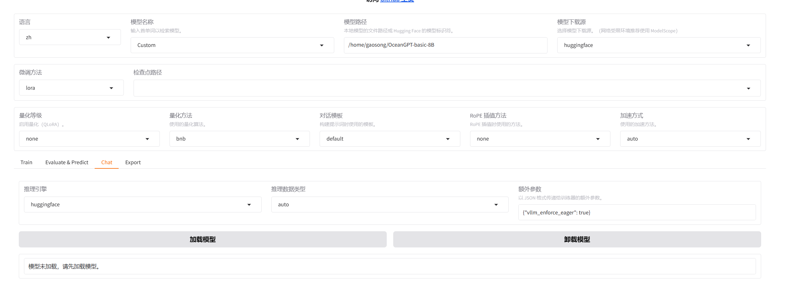

## Fine-Tuning OceanGPT for Task-Oriented QA
​    

 🔍 **Addressing Pain Points**

-   Flipping through hundreds of pages of a ship's operating manual is time-consuming and tedious, often causing key details to be missed.
-   When new maritime policies, regulations, or equipment are introduced, information is scattered and updates lag, making it hard to know where to find what you need.
-   Existing large models have many "blind spots," are difficult to deploy locally, lack industry-specific knowledge, and cannot meet enterprise-level security and privacy requirements.

With the customized knowledge-enhanced question-answering engine fine-tuned from OceanGPT, users can obtain practical guidance instantly—simply by inputting a sentence or a keyword:

 🌟 **For Example**  
1️⃣ **Small Fishing Vessel Energy Saving Manual Q&A Assistant**

-   *Background*: Energy-saving technologies for fishing vessels are updated frequently, making it difficult for boat owners to grasp the key points in real-time.
-   *Implementation*: OceanGPT·Cangyuan reads the "Small Fishing Vessel Energy Saving Manual" and is fine-tuned into a Q&A system that supports professional answers to questions like "How to adjust the propeller blade angle?" and "What is needed for regular maintenance of a fishing boat engine?".

2️⃣ **Zhejiang Provincial Department of Ocean and Fisheries Document QA Assistant**

-   *Background*: Government department documents are numerous and lengthy.
-   *Implementation*: OceanGPT is fine-tuned with documents from the "Zhejiang Provincial Department of Ocean and Fisheries" to provide instant answers to questions like "What is the 226 formation rule?".

This tutorial is based on the open-source OceanGPT·Cangyuan large model, the EasyDataset open-source tool, and the Llama Factory open-source tool, covering the following key steps:

*   Model Acquisition
    -   Download the pre-trained OceanGPT model from HuggingFace/Git/ModelScope
    -   Supports local deployment of the 8B parameter base version
*   EasyDataset Data Engineering
    -   Detailed explanation of the EasyDataset toolchain
    -   Automated generation of Q&A datasets from maritime literature PDFs
    -   Full process configuration for text chunking, question generation, and answer construction
*   Domain Fine-tuning with Llama Factory
    -   Explanation of using the LLaMA Factory visual training platform
    -   Configuration of key parameters
*   Building a Web Application
    -   Using a combination of LangChain + Streamlit
*   User Usage and Effect Validation
    -   Before-and-after comparison tests using typical cases

    This guide provides a practical engineering solution to help you quickly build a professional Q&A system for the maritime domain. Fine-tuning requires only 22GB of VRAM, making it usable on an NVIDIA GeForce RTX 3090. During deployment, int4 quantization technology is used to reduce VRAM usage to about 8GB.

## Quick Start

### 1. Download the OceanGPT Model

#### Download via huggingface

```shell
huggingface-cli download --resume-download zjunlp/OceanGPT-basic-8B --local-dir OceanGPT-basic-8B --local-dir-use-symlinks False
```

#### Download via git

```shell
git lfs install
git clone https://huggingface.co/zjunlp/OceanGPT-basic-8B```
```

#### Download from ModelScope

For users in China, it is recommended to use ModelScope for faster access and a more stable download experience.

-   Command-line download

Before downloading, please install ModelScope with the following command:

```shell
pip install modelscope
```

Download the complete model repository:

```shell
modelscope download --model ZJUNLP/OceanGPT-basic-8B
```

-   Git download

Please ensure that `lfs` has been installed correctly.

```shell
git lfs install
git clone https://www.modelscope.cn/ZJUNLP/OceanGPT-basic-8B.git
```

### 2. Generate Training Data with EasyDataset

#### 2.1 Install EasyDataset (Choose one method)

##### Method 1: Installer Package

Visit the release page to download the installer package for your system: 
<https://github.com/ConardLi/easy-dataset>

##### Method 2: Use the Official Docker Image

Clone the repository:

```shell
git clone https://github.com/ConardLi/easy-dataset.git
cd easy-dataset
```

Modify the `docker-compose.yaml` file:

```yaml
services:
  easy-dataset:
    image: ghcr.io/conardli/easy-dataset
    container_name: easy-dataset
    ports:
      - '1717:1717'
    volumes:
      - ${LOCAL_DB_PATH}:/app/local-db
      - ${LOCAL_PRISMA_PATH}:/app/prisma
    restart: unless-stopped
```

> **Note:** Please replace `{YOUR_LOCAL_DB_PATH}` and `{LOCAL_PRISMA_PATH}` with the actual paths where you want to store the local database. It is recommended to use the `local-db` and `prisma` folders in the current code repository directory to keep the database path consistent with the NPM startup path.
> How to initialize the database file:
>
> ```bash
> # 1. Enter the container terminal
> docker exec -it easy-dataset /bin/sh
> # 2. Set up a domestic mirror source
> npm config set registry https://registry.npmmirror.com
> # 3. Set up a dedicated Prisma mirror source
> export PRISMA_BINARIES_MIRROR=https://npmmirror.com/mirrors/prisma/
> # 4. Execute migration within the container
> npx prisma migrate dev --name init
> # 5. Generate Prisma Client
> npx prisma generate
> # 6. Exit the container
> exit
> # 7. Restart
> docker-compose down && docker-compose up -d
> ```

Start with docker-compose:

```shell
docker-compose up -d
```

Open your browser and visit `http://localhost:1717`

> If you encounter the error: unable to get image 'ghcr.io/conardli/easy-dataset': permission denied while trying to connect to the Docker daemon socket at unix:///var/run/docker.sock: Get "http://%2Fvar%2Frun%2Fdocker.sock/v1.51/images/ghcr.io/conardli/easy-dataset/json": dial unix /var/run/docker.sock: connect: permission denied
> Solution:
>
> Execute the following command to add the current user to the docker group:
> `sudo usermod -aG docker $USER  # Add current user to the docker group`
> `newgrp docker  # Refresh user groups (no reboot required)`
> Then run `docker-compose up -d` again.

#### 2.2 Project Creation and Configuration

Note: The icon in the upper right corner can be used to switch the interface language between Chinese and English, which also determines the language of the generated questions and dataset.

1.  **Create a project**

    -   Visit `http://localhost:1717`
    -   Click `Create Project`
    -   Enter the project name → Confirm creation

    

2.  **Configure the model**

    -   Go to project settings → Open `Model Configuration`
    -   Select the required model (using a model from SiliconFlow as an example)
    -   Click the edit model button and fill in:
        -   Endpoint: Fill in the API address (default is fine)
        -   Model Name: Select the desired model
        -   API Key: Fill in your secret key

    

    -   Click save → Select this model in the upper right corner

    

3.  **Task Configuration**

    -   Go to `Task Configuration`
    -   Settings: Text chunk length: Min=500, Max=1000. Question generation frequency: 1 question per 10 characters.
    -   Click "Save Task Configuration" at the bottom.


#### 2.3 Data Processing and Generation

1.  **File Processing**

    -   Go to `Texts`
    -   Upload relevant PDF files from the maritime domain → Click `Upload and process`
    -   Wait for the processing to complete

    

2.  **Generate Questions**

    -   View the chunked text after processing is complete.
    -   Select all text chunks → Click `Batch generate`
    -   Wait for the generation to complete.

3.  **Construct Dataset**

    -   Go to `Questions`
    -   Select all questions → Click `Batch construct dataset`
    -   Wait for the generation to complete.
    -   Note: Failed items can be regenerated.

    

#### 2.4 Export Dataset

1.  **Export Configuration**

    -   Go to `Datasets`
    -   Click `Export Dataset`
    -   Select `Use in LLaMA Factory`

    

    

2.  **Get Files**

    -   Click `Update LLaMA Factory config`
    -   Copy the generated configuration file path
    -   Key files:
        -   `dataset_info.json` # Dataset configuration
        -   `alpaca.json` # Dataset in Alpaca format
        -   `sharegpt.json` # Dataset in ShareGPT format

> Note: The content of `alpaca.json` and `sharegpt.json` is the same, and either can be used for fine-tuning.

**Precautions:**

1.  API processing time depends on the model service response speed.
2.  Ensure that answers have been successfully generated for all questions before exporting.
3.  If using Docker, the DB path needs to be replaced with the actual path (e.g., `~/easy-dataset/db`).

### 3. Train the Model with Llama Factory

#### 3.1 Environment Preparation and Installation

##### Linux

###### CUDA Installation

CUDA is a parallel computing platform and programming model created by NVIDIA, which allows developers to use NVIDIA GPUs for high-performance parallel computing.

First, check if your GPU supports CUDA at [https://developer.nvidia.com/cuda-gpus](https://developer.nvidia.com/cuda-gpus/)

Ensure your current Linux version supports CUDA. Enter `uname -m && cat /etc/*release` in the command line, and you should see an output similar to this:

```shell
x86_64
DISTRIB_ID=Ubuntu
DISTRIB_RELEASE=22.04
```

Check if `gcc` is installed. Enter `gcc --version` in the command line, and you should see an output similar to this:

```shell
gcc (Ubuntu 11.4.0-1ubuntu1~22.04) 11.4.0
```

Download the required CUDA version from the following URL, version 12.2 is recommended here. [https://developer.nvidia.com/cuda-12-2-0-download-archive/](https://developer.nvidia.com/cuda-12-2-0-download-archive/) Note that you need to select the correct version based on the output above.

> 

If you have installed CUDA before (e.g., version 12.1), you need to uninstall it first using `sudo /usr/local/cuda-12.1/bin/cuda-uninstaller`. If this command does not work, you can do it directly:

```shell
sudo rm -r /usr/local/cuda-12.1/
sudo apt clean && sudo apt autoclean
```

After uninstalling, run the following commands and follow the prompts to continue the installation:

```shell
wget https://developer.download.nvidia.com/compute/cuda/12.2.0/local_installers/cuda_12.2.0_535.54.03_linux.run
sudo sh cuda_12.2.0_535.54.03_linux.run
```

**Note**: It is recommended to cancel the installation of the Driver until you have confirmed that the CUDA-included driver version is compatible with your GPU.


After completion, enter `nvcc -V` to check if the corresponding version number appears. If it does, the installation is complete.


##### Windows

###### CUDA Installation

Open **Settings**, find **Windows Specifications** under **About**, and ensure your system version is in the following list:

| Supported Version Numbers     |
| ----------------------------- |
| Microsoft Windows 11 21H2     |
| Microsoft Windows 11 22H2-SV2 |
| Microsoft Windows 11 23H2     |
| Microsoft Windows 10 21H2     |
| Microsoft Windows 10 22H2     |
| Microsoft Windows Server 2022 |

Select the corresponding version to download and install according to the prompts.


Open cmd and enter `nvcc -V`. If similar content appears, the installation is successful.


Otherwise, check the system environment variables to ensure CUDA is imported correctly.


##### Create a Virtual Environment (Optional)

```bash
conda create -n llamafactory python=3.10
conda activate llamafactory
```

##### Install LLaMA Factory

```bash
git clone --depth 1 https://github.com/hiyouga/LLaMA-Factory.git
cd LLaMA-Factory
pip install -e ".[torch,metrics,modelscope]"
```

##### Verify Installation

```bash
llamafactory-cli version  # Should display version information
----------------------------------------------------------
| Welcome to LLaMA Factory, version 0.9.2                |
|                                                        |
| Project page: https://github.com/hiyouga/LLaMA-Factory |
----------------------------------------------------------
```

#### 3.2 Start the Training Interface

##### Start Web UI

```bash
llamafactory-cli webui
```

##### Access the Interface

After successful startup, visit: <http://localhost:7860>

The language tab can be used to switch the language to Chinese (zh).


#### 3.3 Configure Training Parameters

##### 1. Model Selection

-   In the `Model name` tab, select `Custom`.
-   Fill in the local path of the OceanGPT model.

##### 2. Dataset Configuration

-   `Dataset path`: Use the configuration path exported from EasyDataset (`/your/path/to/easy-dataset-main/local-db/xxxxx/`). After filling this in, the dataset on the right can be selected directly from the dropdown menu.
-   `Dataset`: Select a dataset in Alpaca or sharegpt format.

##### 3. Training Parameter Settings

| Parameter             | Recommended Value      | Description                                                 |
| --------------------- | ---------------------- | ----------------------------------------------------------- |
| Learning Rate         | 1e-4                   | A smaller learning rate helps with fine-grained learning.   |
| Epochs                | 8                      | Increase the number of epochs to learn the data better.     |
| Batch Size            | Adjust based on VRAM   | Must satisfy: batch_size * grad_accum_steps * num_gpus ≈ 32 |
| Gradient Accumulation | Adjust with batch_size | Reduces VRAM pressure.                                      |

#### 3.4 Start Training and Monitoring

-   Click the `Start` button to begin training.
-   View the loss curve in real-time.
-   Observe the training progress in the output log.


#### 3.5 Verify Fine-tuning Effect

##### 3.5.1 Load Fine-tuned Model

1.  Go to the `Chat` tab.
2.  For `Checkpoint path`, select the checkpoint directory output from the training.
3.  Click `Load model`.
4.  Enter questions to verify the response accuracy.



##### 3.5.2 Compare with Original Model

1.  Click `Unload model`.
2.  Switch the `Model path` to the original model.
3.  Click `Load model`.
4.  Enter the same questions to compare the differences in responses.

### 4. Build a Q&A Demo with LangChain + Streamlit

#### 4.1 Get the code from git

```shell
git clone https://github.com/zjunlp/OceanGPT.git
cd OceanGPT
```

#### 4.1 Install packages from requirements.txt using pip

```shell
pip install -r requirements.txt
```

#### 4.2 Set up a domestic mirror (for loading huggingface models)

```shell
export HF_ENDPOINT=https://hf-mirror.com
```

#### 4.3 Set the model loading path

In the `main` function of `rag.py`, set `model_path` to the local download path of the model (the output dir from LLaMA Factory, which should be located at `/YourPath/LLaMA-Factory-main/saves/Custom/lora/train_2025-x-x-x-x-x`).

Note: During deployment, the model is loaded using int4 quantization, which significantly reduces VRAM usage to about 1/2 of the original.

```python
bnb_config = BitsAndBytesConfig(
    load_in_4bit=True,               # int4
    bnb_4bit_use_double_quant=True,
    bnb_4bit_quant_type="nf4",       # nf4 for higher precision
    bnb_4bit_compute_dtype="float16" # use float16 for inference
    )
```

#### 4.4 Start the demo

```shell
streamlit run rag.py
```

#### 4.5 Click the URL to open the website


### 5. Use the Demo for Professional Knowledge Q&A


​	You can upload a file for specific professional knowledge Q&A based on the file, or you can converse with the model without uploading a file. When a file is uploaded, the model will answer based on the file's content and provide a reference source.

#### 5.1 Effect Demonstration

##### (1) Using `Small Fishing Vessel Energy Saving Manual.pdf` as an example

*   First, use the method described above to generate a dataset from the PDF and fine-tune the model to get the fine-tuned model.
*   Set up different models (initial model, fine-tuned model) to start the demo separately for Q&A testing.
*   Effect of the un-fine-tuned model + without uploading a file:


As you can see, it did not answer based on the content of the file.

*   Effect of the un-fine-tuned model + with uploading a file:


It can answer with information related to the file, but it is not very accurate.

*   Effect of the fine-tuned model + with uploading a file:


It answered the question related to the file concisely and accurately.

##### (2) Using `Zhejiang Provincial Department of Ocean and Fisheries Document.pdf` as an example

*   First, use the method described above to generate a dataset from the PDF and fine-tune the model to get the fine-tuned model.
*   Set up different models (initial model, fine-tuned model) to start the demo separately for Q&A testing.
*   Effect of the un-fine-tuned model + without uploading a file:


As you can see, it did not answer based on the content of the file.

*   Effect of the un-fine-tuned model + with uploading a file:


It can answer with information related to the file, but it is not very accurate or concise.

*   Effect of the fine-tuned model + with uploading a file:


It answered the question related to the file concisely and accurately.


This tutorial was jointly completed by Gao Song, Ma Zhe, Deng Hongjie, and others. Special thanks to the open-source tools EasyDataset and Llama Factory.

For feedback on issues, please submit an issue to: https://github.com/zjunlp/OceanGPT

Or email: zhangningyu@zju.edu.cn
