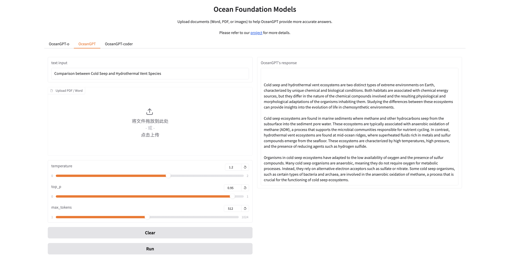
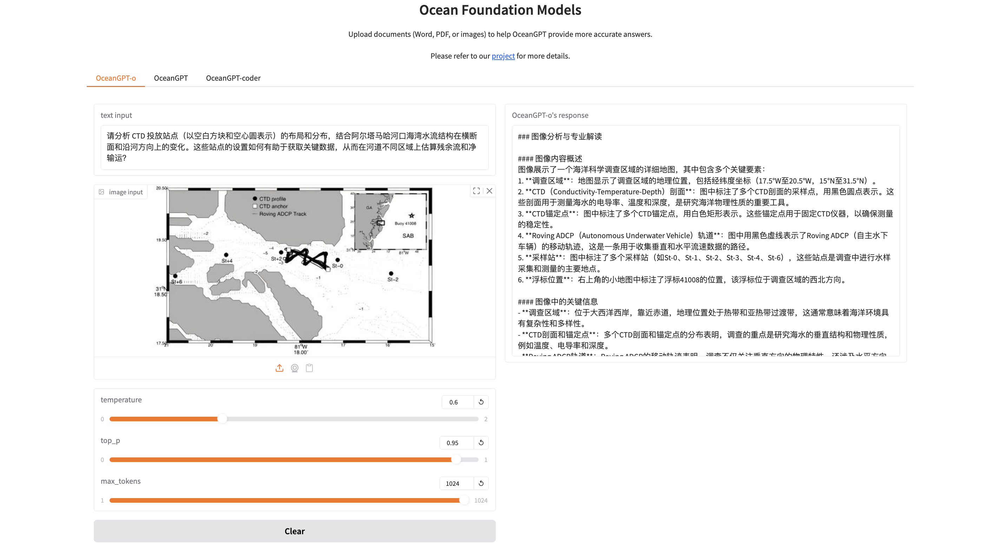
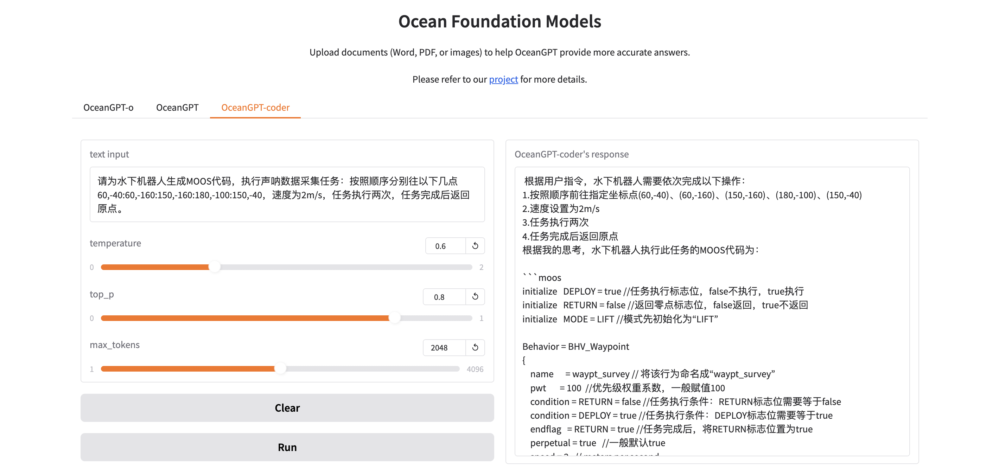

<div align="center">


**沧渊海洋基础大模型：Ocean Foundation Models**

<p align="center">
  <a href="https://github.com/zjunlp/OceanGPT">Project</a> •
  <a href="https://arxiv.org/abs/2310.02031">Paper</a> •
  <a href="https://huggingface.co/collections/zjunlp/oceangpt-664cc106358fdd9f09aa5157">Models</a> •
  <a href="http://oceangpt.blue/">Web</a> •
  <a href="#overview">Overview</a> •
  <a href="#quickstart">Quickstart</a> •
  <a href="#citation">Citation</a>
</p>

[](https://opensource.org/licenses/MIT)


</div>

## Table of Contents

- <a href="#news">What's New</a>
- <a href="#overview">Overview</a>
- <a href="#quickstart">Quickstart</a>
- <a href="#chat-with-our-demo-on-gradio"> 🤗Chat with Our Demo on Gradio</a>
- <a href="#using-mcp-server-for-sonar-image-caption">Using MCP Server for Sonar Image Caption</a>
- <a href="#inference">Inference</a>
    - <a href="#models">Models</a>
    - <a href="#efficient-inference-with-sglang-vllm-ollama-llamacpp">Efficient Inference with sglang, vLLM, ollama, llama.cpp</a>
- <a href="#acknowledgement">Acknowledgement</a>
- <a href="#limitations">Limitations</a>
- <a href="#citation">Citation</a>

## 🔔News
- **2025-04-20, we release the OceanGPT-o-7B and OceanGPT-coder-7B.**
- **2025-02-01, we collect sonar data for model training and test OceanGPT-coder.**
- **2024-12-01, we collect more publicly available sonar data and scientific images for model training.**
- **2024-08-01, we launch bilingual (Chinese-English) multimodal large language model OceanGPT-o with sonar and ocean science image data collection and training.**
- **2024-07-04, we release the OceanGPT-basic-14B/2B and the updated version of OceanGPT-basic-7B (v0.2).**
- **2024-06-04, [OceanGPT](https://arxiv.org/abs/2310.02031) is accepted by ACL 2024. 🎉🎉**
- **2023-10-04, we release the paper "[OceanGPT: A Large Language Model for Ocean Science Tasks](https://arxiv.org/abs/2310.02031)" and release OceanGPT-basic-7B (v0.1) based on LLaMA2.**
- **2023-05-01, we launch the OceanGPT (沧渊) project.**
---

### Models

| Model Name        |        ModelScope                                                                                                              | HuggingFace                                                               |
|-------------------|-----------------------------------------------------------------------------------|-----------------------------------------------------------------------------------------|
| OceanGPT-o-7B (based on Qwen, **recommended**)                      |<a href="https://modelscope.cn/models/ZJUNLP/OceanGPT-o-7B" target="_blank">7B</a>   | <a href="https://huggingface.co/zjunlp/OceanGPT-o-7B" target="_blank">7B</a> |
| OceanGPT-coder-7B (based on Qwen, **recommended**)                                                                      | <a href="https://modelscope.cn/models/ZJUNLP/OceanGPT-coder-7B" target="_blank">7B</a>                                                                        | <a href="https://huggingface.co/zjunlp/OceanGPT-coder-7B" target="_blank">7B</a>
| OceanGPT-basic-8B (based on Qwen, **recommended**) |<a href="https://www.modelscope.cn/models/ZJUNLP/OceanGPT-basic-8B" target="_blank">8B</a>   | <a href="https://huggingface.co/zjunlp/OceanGPT-basic-8B" target="_blank">8B</a> |
| OceanGPT-basic-14B (based on Qwen, legacy) |<a href="https://modelscope.cn/models/ZJUNLP/OceanGPT-14B-v0.1" target="_blank">14B</a>   | <a href="https://huggingface.co/zjunlp/OceanGPT-14B-v0.1" target="_blank">14B</a> |
| OceanGPT-basic-7B (based on Qwen, legacy) |  <a href="https://modelscope.cn/models/ZJUNLP/OceanGPT-7b-v0.2" target="_blank">7B</a>    |  <a href="https://huggingface.co/zjunlp/OceanGPT-7b-v0.2" target="_blank">7B</a>   |
| OceanGPT-basic-2B (based on MiniCPM, legacy) | <a href="https://modelscope.cn/models/ZJUNLP/OceanGPT-2B-v0.1" target="_blank">2B</a>    |  <a href="https://huggingface.co/zjunlp/OceanGPT-2B-v0.1" target="_blank">2B</a>   |


---

- ❗**Please note that the ocean domain Q&A in the online demo system (including the video) is based on knowledge base augmentation and a "general-specialized integration" approach, and the generated content differs from that of the open-source models (注意：在线演示系统和视频里的海洋专业问答采用了知识增强与通专结合等技术，因此和开源模型存在差异)！**
- ❗**Due to limited computing resources, OceanGPT-o is currently only applicable for natural language interpretation and generation of certain types of sonar images and marine science images. It is recommended to use a GPU that is greater than or equal to 24GB.**

### Instruction Data

| Data Name        | HuggingFace                                                                                                                    | ModelScope                                                                |
|-------------------|----------------------------------------------------------------------------------- |-----------------------------------------------------------------------------------------|
| OceanInstruct-v0.2  | <a href="https://huggingface.co/datasets/zjunlp/OceanInstruct-v0.2" target="_blank">50K</a>   | <a href="https://modelscope.cn/datasets/ZJUNLP/OceanInstruct-v0.2" target="_blank">50K</a> |
| OceanInstruct-o  | <a href="https://huggingface.co/datasets/zjunlp/OceanInstruct-o" target="_blank">50K</a>  | <a href="https://modelscope.cn/datasets/ZJUNLP/OceanInstruct-o" target="_blank">50K</a> |
| OceanInstruct-v0.1  | <a href="https://huggingface.co/datasets/zjunlp/OceanInstruct-v0.1" target="_blank">10K</a>  | <a href="https://modelscope.cn/datasets/ZJUNLP/OceanInstruct-v0.1" target="_blank">10K</a> |
---
- ❗**Some of the instruction data are synthetic data; we apologize for any inaccuracies that may exist (部分指令数据为合成数据，如存在错误敬请谅解)！**

## 🌟Overview

<div align="center">

</div>

This is the OceanGPT (沧渊) project, which aims to build ocean foundation model.

- ❗**Disclaimer: This project is purely an academic exploration rather than a product(本项目仅为学术探索并非产品应用). Please be aware that due to the inherent limitations of large language models, there may be issues such as hallucinations.**

<div align="center">

</div>


## ⏩Quickstart

```
conda create -n py3.11 python=3.11
conda activate py3.11
pip install -r requirements.txt
```

### Download the model
#### Download from HuggingFace
```shell
git lfs install
git clone https://huggingface.co/zjunlp/OceanGPT-14B-v0.1
```
or
```
huggingface-cli download --resume-download zjunlp/OceanGPT-14B-v0.1 --local-dir OceanGPT-14B-v0.1 --local-dir-use-symlinks False
```
#### Download from WiseModel
```shell
git lfs install
git clone https://www.wisemodel.cn/zjunlp/OceanGPT-14B-v0.1.git
```
#### Download from ModelScope
```shell
git lfs install
git clone https://www.modelscope.cn/ZJUNLP/OceanGPT-14B-v0.1.git
```

### Inference
#### Inference by HuggingFace
```python
from transformers import AutoModelForCausalLM, AutoTokenizer
import torch

device = "cuda" # the device to load the model onto
path = 'YOUR-MODEL-PATH'

model = AutoModelForCausalLM.from_pretrained(
    path,
    torch_dtype=torch.bfloat16,
    device_map="auto"
)
tokenizer = AutoTokenizer.from_pretrained(path)

prompt = "Which is the largest ocean in the world?"
messages = [
    {"role": "system", "content": "You are a helpful assistant."},
    {"role": "user", "content": prompt}
]
text = tokenizer.apply_chat_template(
    messages,
    tokenize=False,
    add_generation_prompt=True
)
model_inputs = tokenizer([text], return_tensors="pt").to(device)

generated_ids = model.generate(
    model_inputs.input_ids,
    max_new_tokens=512
)
generated_ids = [
    output_ids[len(input_ids):] for input_ids, output_ids in zip(model_inputs.input_ids, generated_ids)
]

response = tokenizer.batch_decode(generated_ids, skip_special_tokens=True)[0]
```
#### Inference by vllm
```python
from transformers import AutoTokenizer
from vllm import LLM, SamplingParams

path = 'YOUR-MODEL-PATH'

tokenizer = AutoTokenizer.from_pretrained(path)

prompt = "Which is the largest ocean in the world?"
messages = [
    {"role": "system", "content": "You are a helpful assistant."},
    {"role": "user", "content": prompt}
]
text = tokenizer.apply_chat_template(
    messages,
    tokenize=False,
    add_generation_prompt=True
)

sampling_params = SamplingParams(temperature=0.8, top_k=50)
llm = LLM(model=path)

response = llm.generate(text, sampling_params)
```

## 🤗Chat with Our Demo on Gradio

### Local WebUI Demo
You can easily deploy the interactive interface locally using the code we provide.

> 🔧 Before running, modify the model path (OceanGPT/OceanGPT-o/OceanGPT-coder's path) in app.py to your local model path.

```python
python app.py
```
Open `https://localhost:7860/` in browser and enjoy the interaction with OceanGPT.

### Online Demo <!-- omit in toc -->

We provide users with an interactive Gradio demo accessible online.

Here is the demo about using OceanGPT:
<table>
    <tr>
        <td></td>
        <td></td>
    </tr>
</table>

1. Input your query (optional: upload an Word/PDF).

2. Choose the generation hyparameters.

3. Run and get results.

Here is the demo about using OceanGPT-o:
<table>
    <tr>
        <td></td>
        <td></td>
    </tr>
</table>

1. Input your query and upload an image.

2. Choose the generation hyparameters.

3. Run and get results.

Here is the demo about using OceanGPT-coder:
<table>
    <tr>
        <td></td>
        <td></td>
    </tr>
</table>

1. Input your query.

2. Choose the generation hyparameters.

3. Run and get code.

## Using MCP Server for Sonar Image Caption

The [mcp_userver](https://github.com/zjunlp/OceanGPT/mcp_server) directory contains the Model Context Protocol (MCP) server for OceanGPT to implement some features.

For detailed setup instructions and usage examples, see the MCP server [README](https://github.com/zjunlp/OceanGPT/mcp_server/README.md).

## 📌Inference

### Efficient Inference with sglang, vLLM, ollama, llama.cpp


<details>
<summary> sglang now officially supports Models based Qwen2.5-VL and Qwen2.5. Click to see. </summary>

1. Install sglang:
```shell
pip install --upgrade pip
pip install uv
uv pip install "sglang[all]>=0.4.6.post4"
```

2. Launch Server:
```python
import requests
from openai import OpenAI
from sglang.test.test_utils import is_in_ci

if is_in_ci():
    from patch import launch_server_cmd
else:
    from sglang.utils import launch_server_cmd

from sglang.utils import wait_for_server, print_highlight, terminate_process


server_process, port = launch_server_cmd(
    "python3 -m sglang.launch_server --model-path zjunlp/OceanGPT-o-7B --host 0.0.0.0"
)

wait_for_server(f"http://localhost:{port}")
```

3. Chat with Model
```python
import requests

url = f"http://localhost:{port}/v1/chat/completions"

data = {
    "model": "Qwen/Qwen2.5-VL-7B-Instruct",
    "messages": [
        {
            "role": "user",
            "content": [
                {"type": "text", "text": "What’s in this image?"},
                {
                    "type": "image_url",
                    "image_url": {
                        "url": "https://github.com/sgl-project/sglang/blob/main/test/lang/example_image.png?raw=true"
                    },
                },
            ],
        }
    ],
    "max_tokens": 300,
}

response = requests.post(url, json=data)
print_highlight(response.text)
```


  </details>


<details>
<summary> vLLM now officially supports Models based Qwen2.5-VL and Qwen2.5. Click to see. </summary>

1. Install vLLM(>=0.7.3):
```shell
pip install vllm
```

2. Run Example:
* [MLLM](https://docs.vllm.ai/en/latest/getting_started/examples/vision_language.html)
* [LLM](https://docs.vllm.ai/en/latest/getting_started/quickstart.html)
  </details>


<details>
<summary>ollama now officially supports Models based Qwen2.5. Click to see.</summary>

Create a file named `Modelfile`
```shell
FROM ./OceanGPT.gguf
TEMPLATE "[INST] {{ .Prompt }} [/INST]"
```

Create the model in Ollama:
```shell
ollama create example -f Modelfile
```

Running the model:
```shell
ollama run example "What is your favourite condiment?"
```
  </details>

<details>
<summary>llama.cpp now officially supports Models based Qwen2.5-hf convert to gguf. Click to see.</summary>

Download OceanGPT PyTorch model from huggingface to "OceanGPT" folder.

Clone llama.cpp and make:
```shell
git clone https://github.com/ggml-org/llama.cpp
cd llama.cpp
make llama-cli
```

And then convert PyTorch model to gguf files:
```shell
python convert-hf-to-gguf.py OceanGPT --outfile OceanGPT.gguf
```

Running the model:
```shell
./llama-cli -m OceanGPT.gguf \
    -co -cnv -p "Your prompt" \
    -fa -ngl 80 -n 512
```
  </details>

## 🌻Acknowledgement

OceanGPT (沧渊) is trained based on the open-sourced large language models including [Qwen](https://huggingface.co/Qwen), [MiniCPM](https://huggingface.co/collections/openbmb/minicpm-2b-65d48bf958302b9fd25b698f), [LLaMA](https://huggingface.co/meta-llama).

OceanGPT is trained based on the open-sourced data and tools including [Moos](https://github.com/moos-tutorials), [UATD](https://openi.pcl.ac.cn/OpenOrcinus_orca/URPC2021_sonar_images_dataset), [Forward-looking Sonar Detection Dataset](https://github.com/XingYZhu/Forward-looking-Sonar-Detection-Dataset), [NKSID](https://github.com/Jorwnpay/NK-Sonar-Image-Dataset), [SeabedObjects-KLSG](https://github.com/huoguanying/SeabedObjects-Ship-and-Airplane-dataset), [Marine Debris](https://github.com/mvaldenegro/marine-debris-fls-datasets/tree/master/md_fls_dataset/data/turntable-cropped).

Thanks for their great contributions!
## Limitations

- The model may have hallucination issues.

- Due to limited computational resources, OceanGPT-o currently only supports natural language generation for certain types of sonar images and ocean science images. OceanGPT-coder currently only supports MOOS code generation.
- We did not optimize the identity and the model may generate identity information similar to that of Qwen/MiniCPM/LLaMA/GPT series models.

- The model's output is influenced by prompt tokens, which may result in inconsistent results across multiple attempts.


### 🚩Citation

Please cite the following paper if you use OceanGPT in your work.

```bibtex
@article{bi2024oceangpt,
  title={OceanGPT: A Large Language Model for Ocean Science Tasks},
  author={Bi, Zhen and Zhang, Ningyu and Xue, Yida and Ou, Yixin and Ji, Daxiong and Zheng, Guozhou and Chen, Huajun},
  journal={arXiv preprint arXiv:2310.02031},
  year={2024}
}

```

---
