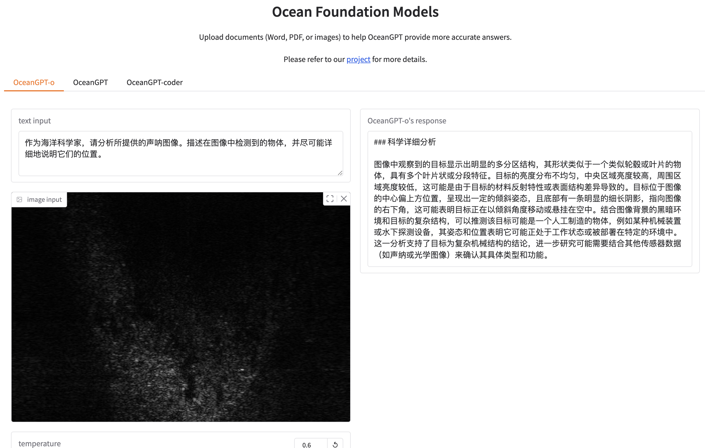
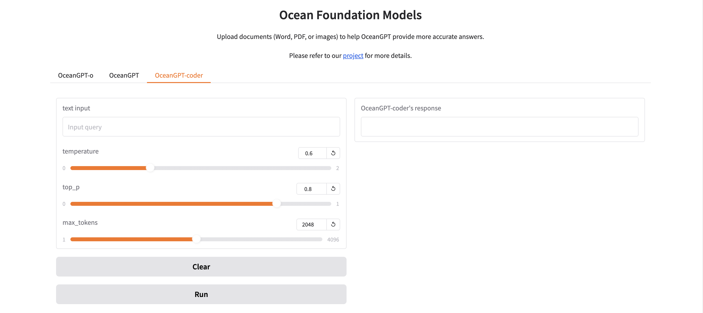

<p align="left">
        English</a>&nbsp ｜ &nbsp<a href="README_CN.md">中文</a>
</p>
<div align="center">
<a href="http://oceangpt.ORG/"></a>

<a href="http://oceangpt.ORG/" style="text-decoration: none;">**沧渊海洋基础大模型：Ocean Foundation Models**</a>

<p align="center">
  <a href="https://github.com/zjunlp/OceanGPT">Project</a> •
  <a href="https://arxiv.org/abs/2310.02031">Paper</a> •
  <a href="https://huggingface.co/collections/zjunlp/oceangpt-664cc106358fdd9f09aa5157">Models</a> •
  <a href="http://oceangpt.ORG/">Web</a> •
  <a href="https://ajar-mayflower-ac1.notion.site/OceanGPT-1f8204ef4eed80db8842c3925dc9b814">Manual</a> •
  <a href="#overview">Overview</a> •
  <a href="#quickstart">Quickstart</a> •
  <a href="#citation">Citation</a>
</p>

[](https://opensource.org/licenses/MIT)


</div>

---

**✨ [OceanGPT Beginner's Guide ](https://ajar-mayflower-ac1.notion.site/OceanGPT-1f8204ef4eed80db8842c3925dc9b814)|[新手教程中文版](https://www.notion.so/OceanGPT-V1-0-225204ef4eed802584d2f77d6d2d5f3e)officially published!**

**✨ [OceanGPT Fine-tuning's Guide ](https://www.notion.so/Fine-Tuning-OceanGPT-for-Task-Oriented-QA-243204ef4eed80bfb47de1acdad24e96)|[定制问答引擎教程中文版](https://www.notion.so/OceanGPT-242204ef4eed809d8ef5e452bf294da7)officially published!**

We have published a detailed beginner's guide for OceanGPT to help you quickly understand its capabilities. If you're looking to customize OceanGPT for practical use, you can refer to the Fine-tuning Guide to build a tailored question-answering engine.


> [!IMPORTANT]
> We regularly **update our open-source models**, so their capabilities may differ from previous versions. We warmly welcome your feedback to help us continuously improve the application of LLMs in the ocean domain.

## Table of Contents

- <a href="#news">What's New</a>
- <a href="#overview">Overview</a>
- <a href="#quickstart">Quickstart</a>
- <a href="#chat-with-our-demo-on-gradio"> 🤗Chat with Our Demo on Gradio</a>
- <a href="#fine-tuning-oceangpt-for-building-customized-qa-applications">Fine-tuning OceanGPT for Building Customized QA Applications</a>
- <a href="#using-mcp-server-for-sonar-image-caption">Using MCP Server for Sonar Image Caption</a>
- <a href="#inference">Inference</a>
    - <a href="#models">Models</a>
    - <a href="#efficient-inference-with-sglang-vllm-ollama-llamacpp">Efficient Inference with sglang, vLLM, ollama, llama.cpp</a>
- <a href="#acknowledgement">Acknowledgement</a>
- <a href="#limitations">Limitations</a>
- <a href="#citation">Citation</a>

## 🔔News
- **2025-10-1, we released the initial version of OceanGym along with the accompanying [paper](https://arxiv.org/abs/2509.26536).**
- **2025-08-05, we release a [tutorial](https://github.com/zjunlp/OceanGPT/blob/main/CustomQA_EN.md) on fine-tuning the OceanGPT model for Task-Oriented QA tasks.**
- **2025-06-17, we release the OceanGPT-coder-0.6B.**
- **2025-05-29, we deploy the OceanGPT MCP Server to support sonar image interpretation.**
- **2025-04-20, we release the OceanGPT-o-7B and OceanGPT-coder-7B.**
- **2025-02-01, we collect sonar data for model training and test OceanGPT-coder.**
- **2024-12-01, we collect more publicly available sonar data and scientific images for model training.**
- **2024-08-01, we launch bilingual (Chinese-English) multimodal large language model OceanGPT-o with sonar and ocean science image data collection and training.**
- **2024-07-04, we release the OceanGPT-basic-14B/2B and the updated version of OceanGPT-basic-7B (v0.2).**
- **2024-06-04, [OceanGPT](https://arxiv.org/abs/2310.02031) is accepted by ACL 2024. 🎉🎉**
- **2023-10-04, we release the paper "[OceanGPT: A Large Language Model for Ocean Science Tasks](https://arxiv.org/abs/2310.02031)" and release OceanGPT-basic-7B (v0.1) based on LLaMA2.**
- **2023-05-01, we launch the OceanGPT (沧渊) project.**
---

### Models

| Model Name        |        ModelScope                                                                                                              | HuggingFace                                                               |
|-------------------|-----------------------------------------------------------------------------------|-----------------------------------------------------------------------------------------|
| OceanGPT-o-7B (based on Qwen, **recommended**)                      |<a href="https://modelscope.cn/models/ZJUNLP/OceanGPT-o-7B" target="_blank">7B</a>   | <a href="https://huggingface.co/zjunlp/OceanGPT-o-7B" target="_blank">7B</a> |
| OceanGPT-coder-7B (based on Qwen, **recommended**)                                                                      | <a href="https://modelscope.cn/models/ZJUNLP/OceanGPT-coder-7B" target="_blank">7B</a>                                                                        | <a href="https://huggingface.co/zjunlp/OceanGPT-coder-7B" target="_blank">7B</a>
| OceanGPT-basic-8B (based on Qwen, **recommended**) |<a href="https://www.modelscope.cn/models/ZJUNLP/OceanGPT-basic-8B" target="_blank">8B</a>   | <a href="https://huggingface.co/zjunlp/OceanGPT-basic-8B" target="_blank">8B</a> |
| OceanGPT-basic-14B (based on Qwen, legacy) |<a href="https://modelscope.cn/models/ZJUNLP/OceanGPT-14B-v0.1" target="_blank">14B</a>   | <a href="https://huggingface.co/zjunlp/OceanGPT-14B-v0.1" target="_blank">14B</a> |
| OceanGPT-basic-7B (based on Qwen, legacy) |  <a href="https://modelscope.cn/models/ZJUNLP/OceanGPT-7b-v0.2" target="_blank">7B</a>    |  <a href="https://huggingface.co/zjunlp/OceanGPT-7b-v0.2" target="_blank">7B</a>   |
| OceanGPT-basic-2B (based on MiniCPM, legacy) | <a href="https://modelscope.cn/models/ZJUNLP/OceanGPT-2B-v0.1" target="_blank">2B</a>    |  <a href="https://huggingface.co/zjunlp/OceanGPT-2B-v0.1" target="_blank">2B</a>   |
| OceanGPT-coder-0.6B (based on Qwen3) | <a href="https://www.modelscope.cn/models/ZJUNLP/OceanGPT-coder-0.6B" target="_blank">0.6B</a>    |  <a href="https://huggingface.co/zjunlp/OceanGPT-coder-0.6B" target="_blank">0.6B</a>   |

---

- ❗**Please note that the ocean domain Q&A in the online demo system (including the video) is based on knowledge base augmentation and a "general-specialized integration" approach, and the generated content differs from that of the open-source models (注意：在线演示系统和视频里的海洋专业问答采用了知识增强与通专结合等技术，因此和开源模型存在差异)！**
- ❗**Due to limited computing resources, OceanGPT-o is currently only applicable for natural language interpretation and generation of certain types of sonar images and marine science images. It is recommended to use a GPU that is greater than or equal to 24GB.**

### Instruction Data

| Data Name        | HuggingFace                                                                                                                    | ModelScope                                                                |
|-------------------|----------------------------------------------------------------------------------- |-----------------------------------------------------------------------------------------|
| OceanInstruct-v0.2  | <a href="https://huggingface.co/datasets/zjunlp/OceanInstruct-v0.2" target="_blank">50K</a>   | <a href="https://modelscope.cn/datasets/ZJUNLP/OceanInstruct-v0.2" target="_blank">50K</a> |
| OceanInstruct-o  | <a href="https://huggingface.co/datasets/zjunlp/OceanInstruct-o" target="_blank">50K</a>  | <a href="https://modelscope.cn/datasets/ZJUNLP/OceanInstruct-o" target="_blank">50K</a> |
| OceanInstruct-v0.1  | <a href="https://huggingface.co/datasets/zjunlp/OceanInstruct-v0.1" target="_blank">10K</a>  | <a href="https://modelscope.cn/datasets/ZJUNLP/OceanInstruct-v0.1" target="_blank">10K</a> |
---
- ❗**Some of the instruction data are synthetic data; we apologize for any inaccuracies that may exist (部分指令数据为合成数据，如存在错误敬请谅解)！**

## 🌟Overview

<div align="center">

</div>

This is the OceanGPT (沧渊) project, which aims to build ocean foundation model.


## ⏩Quickstart

```
conda create -n py3.11 python=3.11
conda activate py3.11
pip install -r requirements.txt
```

### Download the model
#### Download from HuggingFace
```shell
# use git lfs
git lfs install
git clone https://huggingface.co/zjunlp/OceanGPT-o-7B
```
or
```shell
# use huggingface-cli
pip install -U huggingface_hub
huggingface-cli download --resume-download zjunlp/OceanGPT-o-7B --local-dir OceanGPT-o-7B --local-dir-use-symlinks False
```
<!-- #### Download from WiseModel
```shell
git lfs install
git clone https://www.wisemodel.cn/zjunlp/OceanGPT-14B-v0.1.git
``` -->
#### Download from ModelScope
```shell
# use git lfs
git lfs install
git clone https://www.modelscope.cn/ZJUNLP/OceanGPT-o-7B.git
```
or
```shell
# use modelscope
pip install modelscope
modelscope download --model ZJUNLP/OceanGPT-o-7B
```

### Inference
#### OceanGPT-basic-8B
```python
from transformers import AutoModelForCausalLM, AutoTokenizer

model_name = "zjunlp/OceanGPT-basic-8B"

# load the tokenizer and the model
tokenizer = AutoTokenizer.from_pretrained(model_name)
model = AutoModelForCausalLM.from_pretrained(
    model_name,
    torch_dtype="auto",
    device_map="auto"
)

question = "<Your Question>"
messages = [
    {"role": "user", "content": question}
]

text = tokenizer.apply_chat_template(
    messages,
    tokenize=False,
    add_generation_prompt=True,
    enable_thinking=False 
)

model_inputs = tokenizer([text], return_tensors="pt").to(model.device)

generated_ids = model.generate(
    **model_inputs,
    max_new_tokens=8192
)
output_ids = generated_ids[0][len(model_inputs.input_ids[0]):].tolist() 

try:
    index = len(output_ids) - output_ids[::-1].index(151668)  # </think> token ID
except ValueError:
    index = 0

content = tokenizer.decode(output_ids[index:], skip_special_tokens=True).strip("\n")
print(content)
```

#### OceanGPT-o-7B
```shell
# It's highly recommanded to use `[decord]` feature for faster video loading.
pip install qwen-vl-utils[decord]==0.0.8
pip install transformers
```
```python
from transformers import Qwen2_5_VLForConditionalGeneration, AutoTokenizer, Qwen2VLProcessor
from qwen_vl_utils import process_vision_info
import torch

model = Qwen2_5_VLForConditionalGeneration.from_pretrained(
    "zjunlp/OceanGPT-o-7B", torch_dtype=torch.bfloat16, device_map="auto"
)
processor = Qwen2VLProcessor.from_pretrained("zjunlp/OceanGPT-o-7B")

messages = [
    {
        "role": "user",
        "content": [
            {
                "type": "image",
                "image": "file:///path/to/your/image.jpg",
            },
            {"type": "text", "text": "Describe this image."},
        ],
    }
]

text = processor.apply_chat_template(messages, tokenize=False, add_generation_prompt=True)
image_inputs, video_inputs = process_vision_info(messages)
inputs = processor(
    text=[text],
    images=image_inputs,
    videos=video_inputs,
    padding=True,
    return_tensors="pt",
)
inputs = inputs.to("cuda")


generated_ids = model.generate(**inputs, max_new_tokens=128)
generated_ids_trimmed = [
    out_ids[len(in_ids):] for in_ids, out_ids in zip(inputs.input_ids, generated_ids)
]
output_text = processor.batch_decode(
    generated_ids_trimmed, skip_special_tokens=True, clean_up_tokenization_spaces=False
)
print(output_text)
```

#### OceanGPT-coder-7B
```python
from transformers import AutoModelForCausalLM, AutoTokenizer
import torch

model = AutoModelForCausalLM.from_pretrained(
    "zjunlp/OceanGPT-coder-7B", torch_dtype=torch.float16, device_map="auto"
)
tokenizer = AutoTokenizer.from_pretrained("zjunlp/OceanGPT-coder-7B")
messages = [
    {"role": "system", "content": "You are Qwen, created by Alibaba Cloud. You are a helpful assistant."},
    {"role": "user", "content": "请为水下机器人生成MOOS代码，实现如下任务：先回到（50,20）点，然后以（15,20）点为圆形，做半径为30的圆周运动，持续时间200s，速度4 m/s。"}
]
text = tokenizer.apply_chat_template(
    messages,
    tokenize=False,
    add_generation_prompt=True
)
model_inputs = tokenizer([text], return_tensors="pt").to(model.device)
generated_ids = model.generate(
    **model_inputs,
    top_p=0.6,
    temperature=0.6,
    max_new_tokens=2048
)
generated_ids = [
    output_ids[len(input_ids):] for input_ids, output_ids in zip(model_inputs.input_ids, generated_ids)
]
response = tokenizer.batch_decode(generated_ids, skip_special_tokens=True)[0]
print(response)
```

#### Inference by vllm
```python
from transformers import AutoTokenizer
from vllm import LLM, SamplingParams

path = 'YOUR-MODEL-PATH'

tokenizer = AutoTokenizer.from_pretrained(path)

prompt = "Which is the largest ocean in the world?"
messages = [
    {"role": "system", "content": "You are a helpful assistant."},
    {"role": "user", "content": prompt}
]
text = tokenizer.apply_chat_template(
    messages,
    tokenize=False,
    add_generation_prompt=True
)

sampling_params = SamplingParams(temperature=0.8, top_k=50)
llm = LLM(model=path)

response = llm.generate(text, sampling_params)
```

## 🤗Chat with Our Demo on Gradio

### Local WebUI Demo
You can easily deploy the interactive interface locally using the code we provide.

> 🔧 Before running, modify the model path (OceanGPT/OceanGPT-o/OceanGPT-coder's path) in app.py to your local model path.

```shell
python app.py
```
Open `https://localhost:7860/` in browser and enjoy the interaction with OceanGPT.

### Online Demo <!-- omit in toc -->
#### Marine Expertise Q&A
<table>
    <tr>
        <td></td>
        <td></td>
    </tr>
</table>
You can use OceanGPT-basic for marine expertise Q&A.

1. Input your query (optional: upload an Word/PDF).
2. Choose the generation hyparameters.
3. Run and get results.
   
#### Marine Science Image Interpretation
<table>
    <tr>
        <td></td>
        <td></td>
    </tr>
</table>
You can use OceanGPT-o for marine science image interpretation.

1. Input your query and upload an image.
2. Choose the generation hyparameters.
3. Run and get results.

#### Marine Sonar Image Interpretation
<table>
    <tr>
        <td></td>
        <td></td>
    </tr>
</table>
You can use OceanGPT-o for marine sonar image interpretation.

1. Input your query and upload an image.
2. Choose the generation hyparameters.
3. Run and get results.


#### Underwater Robot MOOS Code Generation
<table>
    <tr>
        <td></td>
        <td></td>
    </tr>
</table>
You can use OceanGPT-coder for moos code generation.

1. Input your query.
2. Choose the generation hyparameters.
3. Run and get code.

## Fine-tuning OceanGPT for Building Customized QA Applications

This tutorial is based on the open-source OceanGPT·Cangyuan large model, the EasyDataset open-source tool, and the Llama Factory open-source tool, covering the following key steps:

*   Model Acquisition
*   EasyDataset Data Engineering
*   Domain Fine-tuning with Llama Factory
*   Building a Web Application
*   User Usage and Effect Validation

This guide provides a practical engineering solution to help you quickly build a professional Q&A system for the maritime domain. For detailed setup instructions and usage examples, see the [CustomQA_CN.md](https://github.com/zjunlp/OceanGPT/blob/main/CustomQA_CN.md) or [CustomQA_EN.md](https://github.com/zjunlp/OceanGPT/blob/main/CustomQA_EN.md).

## Using MCP Server for Sonar Image Caption

The [mcp_userver](https://github.com/zjunlp/OceanGPT/tree/main/mcp_server) directory contains the Model Context Protocol (MCP) server for OceanGPT to implement some features.

For detailed setup instructions and usage examples, see the MCP server [README](https://github.com/zjunlp/OceanGPT/blob/main/mcp_server/README.md).

## 📌Inference

### Efficient Inference with sglang, vLLM, ollama, llama.cpp


<details>
<summary> sglang now officially supports Models based Qwen2.5-VL and Qwen2.5. Click to see. </summary>

1. Install sglang:
```shell
pip install --upgrade pip
pip install uv
uv pip install "sglang[all]>=0.4.6.post4"
```

2. Launch Server:
```python
import requests
from openai import OpenAI
from sglang.test.test_utils import is_in_ci

if is_in_ci():
    from patch import launch_server_cmd
else:
    from sglang.utils import launch_server_cmd

from sglang.utils import wait_for_server, print_highlight, terminate_process


server_process, port = launch_server_cmd(
    "python3 -m sglang.launch_server --model-path zjunlp/OceanGPT-o-7B --host 0.0.0.0"
)

wait_for_server(f"http://localhost:{port}")
```

3. Chat with Model
```python
import requests

url = f"http://localhost:{port}/v1/chat/completions"

data = {
    "model": "Qwen/Qwen2.5-VL-7B-Instruct",
    "messages": [
        {
            "role": "user",
            "content": [
                {"type": "text", "text": "What’s in this image?"},
                {
                    "type": "image_url",
                    "image_url": {
                        "url": "https://github.com/sgl-project/sglang/blob/main/test/lang/example_image.png?raw=true"
                    },
                },
            ],
        }
    ],
    "max_tokens": 300,
}

response = requests.post(url, json=data)
print_highlight(response.text)
```


  </details>


<details>
<summary> vLLM now officially supports Models based Qwen2.5-VL and Qwen2.5. Click to see. </summary>

1. Install vLLM(>=0.7.3):
```shell
pip install vllm
```

2. Run Example:
* [MLLM](https://docs.vllm.ai/en/latest/getting_started/examples/vision_language.html)
* [LLM](https://docs.vllm.ai/en/latest/getting_started/quickstart.html)
  </details>


<details>
<summary>ollama now officially supports Models based Qwen2.5. Click to see.</summary>

Create a file named `Modelfile`
```shell
FROM ./OceanGPT.gguf
TEMPLATE "[INST] {{ .Prompt }} [/INST]"
```

Create the model in Ollama:
```shell
ollama create example -f Modelfile
```

Running the model:
```shell
ollama run example "What is your favourite condiment?"
```
  </details>

<details>
<summary>llama.cpp now officially supports Models based Qwen2.5-hf convert to gguf. Click to see.</summary>

Download OceanGPT PyTorch model from huggingface to "OceanGPT" folder.

Clone llama.cpp and make:
```shell
git clone https://github.com/ggml-org/llama.cpp
cd llama.cpp
make llama-cli
```

And then convert PyTorch model to gguf files:
```shell
python convert-hf-to-gguf.py OceanGPT --outfile OceanGPT.gguf
```

Running the model:
```shell
./llama-cli -m OceanGPT.gguf \
    -co -cnv -p "Your prompt" \
    -fa -ngl 80 -n 512
```
  </details>

## 🌻Acknowledgement

OceanGPT (沧渊) is trained based on the open-sourced large language models including [Qwen](https://huggingface.co/Qwen), [MiniCPM](https://huggingface.co/collections/openbmb/minicpm-2b-65d48bf958302b9fd25b698f), [LLaMA](https://huggingface.co/meta-llama).

OceanGPT is trained based on the open-sourced data and tools including [Moos](https://github.com/moos-tutorials), [UATD](https://openi.pcl.ac.cn/OpenOrcinus_orca/URPC2021_sonar_images_dataset), [Forward-looking Sonar Detection Dataset](https://github.com/XingYZhu/Forward-looking-Sonar-Detection-Dataset), [NKSID](https://github.com/Jorwnpay/NK-Sonar-Image-Dataset), [SeabedObjects-KLSG](https://github.com/huoguanying/SeabedObjects-Ship-and-Airplane-dataset), [Marine Debris](https://github.com/mvaldenegro/marine-debris-fls-datasets/tree/master/md_fls_dataset/data/turntable-cropped).

Thanks for their great contributions!
## Limitations

- The model may have hallucination issues.

- Due to limited computational resources, OceanGPT-o currently only supports natural language generation for certain types of sonar images and ocean science images. OceanGPT-coder currently only supports `MOOS` code generation.

- We did not optimize the identity and the model may generate identity information similar to that of Qwen/MiniCPM/LLaMA/GPT series models.

- The model's output is influenced by prompt tokens, which may result in inconsistent results across multiple attempts.


### 🚩Citation

Please cite the following paper if you use OceanGPT in your work.

```bibtex
@article{bi2024oceangpt,
  title={OceanGPT: A Large Language Model for Ocean Science Tasks},
  author={Bi, Zhen and Zhang, Ningyu and Xue, Yida and Ou, Yixin and Ji, Daxiong and Zheng, Guozhou and Chen, Huajun},
  journal={arXiv preprint arXiv:2310.02031},
  year={2024}
}

```

---

# Contributors

[Ningyu Zhang](https://person.zju.edu.cn/en/ningyu), Yida Xue, Zhen Bi, Xiaozhuan Liang,  Zhisong Qiu, Kewei Xu, Chenxi Wang, Shumin Deng, Xiangyuan Ru, Jintian Zhang, Shuofei Qiao, Guozhou Zheng, Huajun Chen


Community Contributors: Junjie Zheng, Zhe Ma, Shuwei Peng, Song Gao
