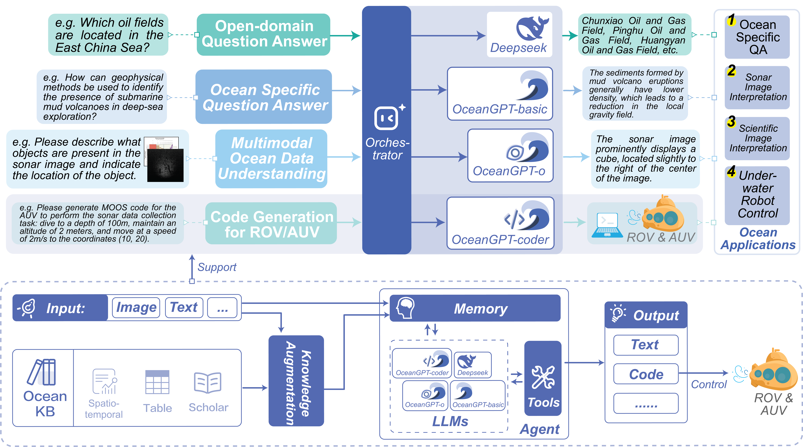
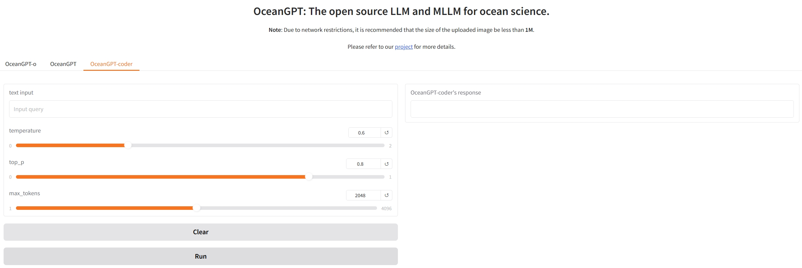
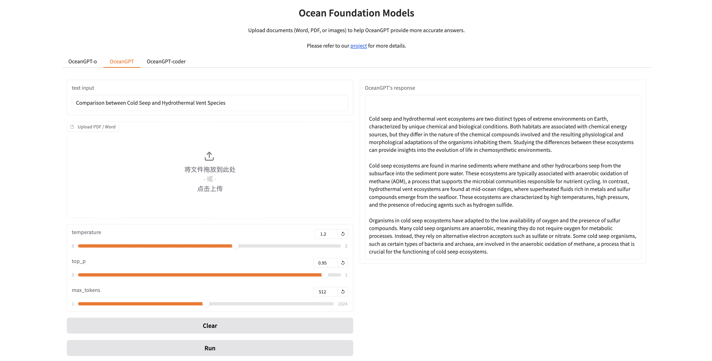
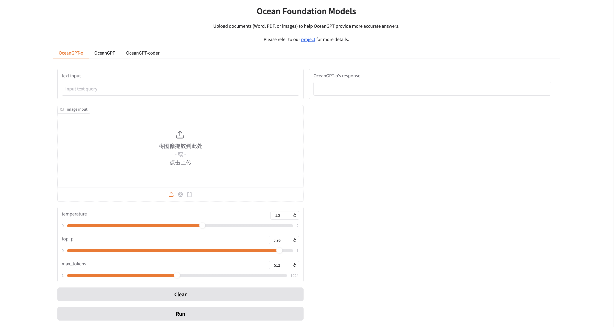
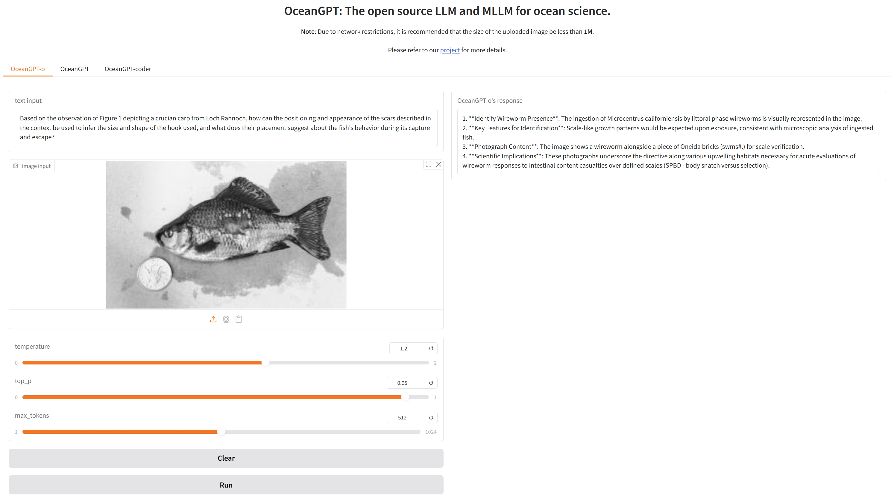
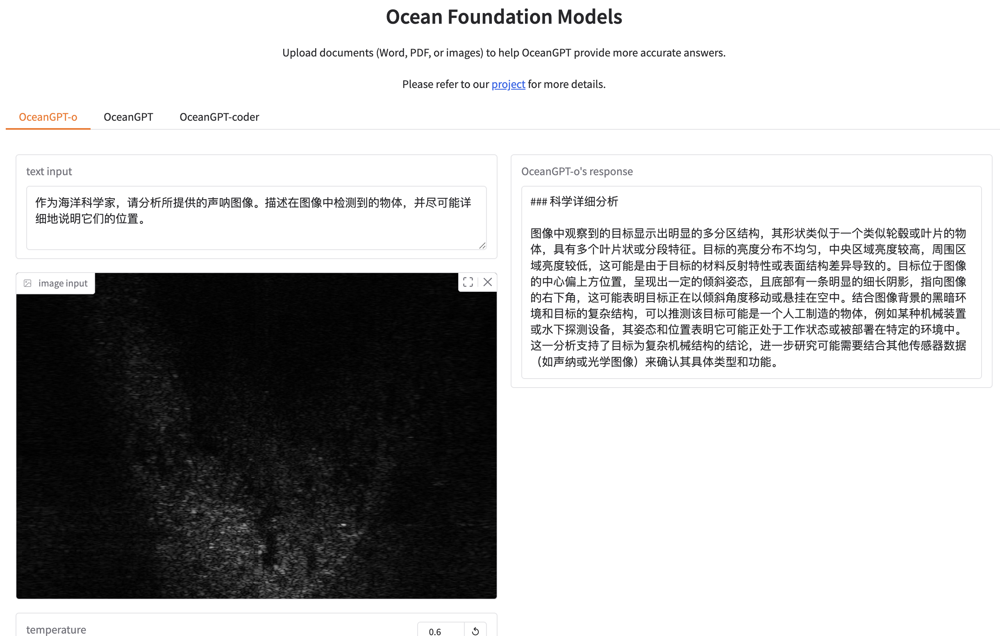
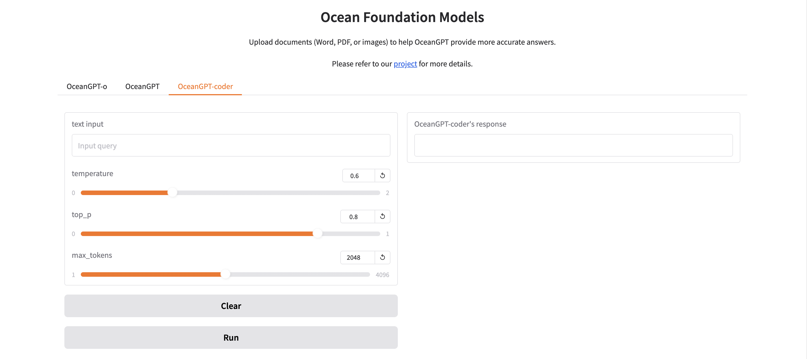
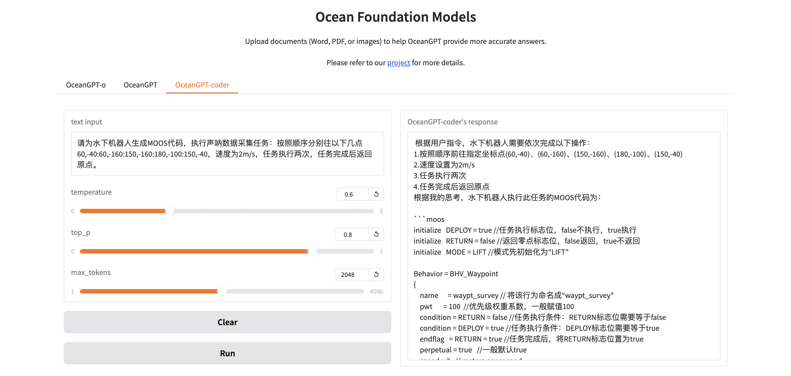

<p align="left">
        中文</a>&nbsp ｜ &nbsp<a href="README.md">English</a>
</p>
<br>
<div align="center">


**OceanGPT (沧渊): 一个面向海洋科学任务的大语言模型**

<p align="center">
    <a href="https://github.com/zjunlp/OceanGPT">项目</a> •
    <a href="https://arxiv.org/abs/2310.02031">论文</a> •
    <a href="https://huggingface.co/collections/zjunlp/oceangpt-664cc106358fdd9f09aa5157">模型</a> •
    <a href="http://oceangpt.zjukg.cn/">网站</a> •
    <a href="https://ajar-mayflower-ac1.notion.site/OceanGPT-1f8204ef4eed80db8842c3925dc9b814">手册</a> •
    <a href="#概述">概述</a> •
    <a href="#快速开始">快速开始</a> •
    <a href="#引用">引用</a>
</p>

[](https://opensource.org/licenses/MIT)
  <a href='https://hyper.ai/datasets/32992'></a> 


</div>


**✨ [OceanGPT 新手教程](https://ajar-mayflower-ac1.notion.site/OceanGPT-1f8204ef4eed80db8842c3925dc9b814)|[新手教程中文版](https://www.notion.so/OceanGPT-V1-0-225204ef4eed802584d2f77d6d2d5f3e)正式发布！**

**✨ [OceanGPT 微调教程](https://www.notion.so/Fine-Tuning-OceanGPT-for-Task-Oriented-QA-243204ef4eed80bfb47de1acdad24e96)|[定制问答引擎教程中文版](https://www.notion.so/OceanGPT-242204ef4eed809d8ef5e452bf294da7)正式发布！**

我们发布了详细的OceanGPT新手教程，帮助您快速了解其功能。如果您想要为实际使用定制OceanGPT，可以参考微调教程来构建定制的问答引擎。


> [!IMPORTANT]
> 我们定期**更新我们的开源模型**，因此它们的功能可能与之前的版本有所不同。我们热烈欢迎您的反馈，以帮助我们持续改进LLM在海洋领域的应用。

## 目录

- <a href="#最新动态">最新动态</a>
- <a href="#概述">概述</a>
- <a href="#快速开始">快速开始</a>
- <a href="#与我们的Gradio演示对话"> 🤗与我们的Gradio演示对话</a>
- <a href="#基于 OceanGPT 构建定制化问答应用">基于 OceanGPT 构建定制化问答应用</a>
- <a href="#📌推理">推理</a>
    - <a href="#模型">模型</a>
    - <a href="#使用sglang、vLLM、ollama、llama.cpp进行高效推理">使用sglang、vLLM、ollama、llama.cpp进行高效推理</a>
- <a href="#致谢">致谢</a>
- <a href="#局限性">局限性</a>
- <a href="#引用">引用</a>

## 🔔最新动态
- **2025-08-05，我们发布了关于微调OceanGPT模型进行任务导向问答任务的[教程](https://github.com/zjunlp/OceanGPT/blob/main/CustomQA_EN.md)。**
- **2025-06-17，我们发布了OceanGPT-coder-0.6B。**
- **2025-05-29，我们部署了OceanGPT MCP服务器以支持声纳图像解释。**
- **2025-04-20，我们发布了OceanGPT-o-7B和OceanGPT-coder-7B。**
- **2025-02-01，我们收集声纳数据进行模型训练并测试OceanGPT-coder。**
- **2024-12-01，我们收集更多公开可用的声纳数据和科学图像进行模型训练。**
- **2024-08-01，我们启动了双语（中英文）多模态大语言模型OceanGPT-o，收集和训练声纳和海洋科学图像数据。**
- **2024-07-04，我们发布了OceanGPT-basic-14B/2B和更新版本的OceanGPT-basic-7B（v0.2）。**
- **2024-06-04，[OceanGPT](https://arxiv.org/abs/2310.02031)被ACL 2024接收。🎉🎉**
- **2023-10-04，我们发布了论文"[OceanGPT: A Large Language Model for Ocean Science Tasks](https://arxiv.org/abs/2310.02031)"并发布了基于LLaMA2的OceanGPT-basic-7B（v0.1）。**
- **2023-05-01，我们启动了OceanGPT（沧渊）项目。**
---
### 模型

| 模型名称        |        ModelScope                                                                                                              | HuggingFace                                                               |
|-------------------|-----------------------------------------------------------------------------------|-----------------------------------------------------------------------------------------|
| OceanGPT-o-7B (基于Qwen，**推荐**)                      |<a href="https://modelscope.cn/models/ZJUNLP/OceanGPT-o-7B" target="_blank">7B</a>   | <a href="https://huggingface.co/zjunlp/OceanGPT-o-7B" target="_blank">7B</a> |
| OceanGPT-coder-7B (基于Qwen，**推荐**)                                                                      | <a href="https://modelscope.cn/models/ZJUNLP/OceanGPT-coder-7B" target="_blank">7B</a>                                                                        | <a href="https://huggingface.co/zjunlp/OceanGPT-coder-7B" target="_blank">7B</a>
| OceanGPT-basic-8B (基于Qwen，**推荐**) |<a href="https://www.modelscope.cn/models/ZJUNLP/OceanGPT-basic-8B" target="_blank">8B</a>   | <a href="https://huggingface.co/zjunlp/OceanGPT-basic-8B" target="_blank">8B</a> |
| OceanGPT-basic-14B (基于Qwen，旧版) |<a href="https://modelscope.cn/models/ZJUNLP/OceanGPT-14B-v0.1" target="_blank">14B</a>   | <a href="https://huggingface.co/zjunlp/OceanGPT-14B-v0.1" target="_blank">14B</a> |
| OceanGPT-basic-7B (基于Qwen，旧版) |  <a href="https://modelscope.cn/models/ZJUNLP/OceanGPT-7b-v0.2" target="_blank">7B</a>    |  <a href="https://huggingface.co/zjunlp/OceanGPT-7b-v0.2" target="_blank">7B</a>   |
| OceanGPT-basic-2B (基于MiniCPM，旧版) | <a href="https://modelscope.cn/models/ZJUNLP/OceanGPT-2B-v0.1" target="_blank">2B</a>    |  <a href="https://huggingface.co/zjunlp/OceanGPT-2B-v0.1" target="_blank">2B</a>   |
| OceanGPT-coder-0.6B (基于Qwen3) | <a href="https://www.modelscope.cn/models/ZJUNLP/OceanGPT-coder-0.6B" target="_blank">0.6B</a>    |  <a href="https://huggingface.co/zjunlp/OceanGPT-coder-0.6B" target="_blank">0.6B</a>   |

---

- ❗**请注意，在线演示系统（包括视频）中的海洋领域问答基于知识库增强和"通专结合"方法，生成的内容与开源模型存在差异！**
- ❗**由于计算资源有限，OceanGPT-o目前仅适用于某些类型声纳图像和海洋科学图像的自然语言解释和生成。建议使用大于或等于24GB的GPU**

### 指令数据

| 数据名称        | HuggingFace                                                                                                                    | ModelScope                                                                |
|-------------------|----------------------------------------------------------------------------------- |-----------------------------------------------------------------------------------------|
| OceanInstruct-v0.2  | <a href="https://huggingface.co/datasets/zjunlp/OceanInstruct-v0.2" target="_blank">50K</a>   | <a href="https://modelscope.cn/datasets/ZJUNLP/OceanInstruct-v0.2" target="_blank">50K</a> |
| OceanInstruct-o  | <a href="https://huggingface.co/datasets/zjunlp/OceanInstruct-o" target="_blank">50K</a>  | <a href="https://modelscope.cn/datasets/ZJUNLP/OceanInstruct-o" target="_blank">50K</a> |
| OceanInstruct-v0.1  | <a href="https://huggingface.co/datasets/zjunlp/OceanInstruct-v0.1" target="_blank">10K</a>  | <a href="https://modelscope.cn/datasets/ZJUNLP/OceanInstruct-v0.1" target="_blank">10K</a> |
---
- ❗**部分指令数据为合成数据；如存在错误敬请谅解（部分指令数据为合成数据，如存在错误敬请谅解）！**

## 🌟概述

这是OceanGPT (沧渊) 项目，旨在为海洋科学任务构建大语言模型。

- ❗**免责声明：本项目纯属学术探索，并非产品应用（本项目仅为学术探索并非产品应用）。请注意，由于大型语言模型的固有局限性，可能会出现幻觉等问题。**

<div align="center">


</div>


## ⏩快速开始

```
conda create -n py3.11 python=3.11
conda activate py3.11
pip install -r requirements.txt
```

### 下载模型
#### 从HuggingFace下载
```shell
git lfs install
git clone https://huggingface.co/zjunlp/OceanGPT-14B-v0.1
```
或
```
huggingface-cli download --resume-download zjunlp/OceanGPT-14B-v0.1 --local-dir OceanGPT-14B-v0.1 --local-dir-use-symlinks False
```
#### 从WiseModel下载
```shell
git lfs install
git clone https://www.wisemodel.cn/zjunlp/OceanGPT-14B-v0.1.git
```
#### 从ModelScope下载
```shell
git lfs install
git clone https://www.modelscope.cn/ZJUNLP/OceanGPT-14B-v0.1.git
```

### 推理
#### OceanGPT-basic-8B
```python
from transformers import AutoModelForCausalLM, AutoTokenizer

model_name = "zjunlp/OceanGPT-basic-8B"

# 加载分词器和模型
tokenizer = AutoTokenizer.from_pretrained(model_name)
model = AutoModelForCausalLM.from_pretrained(
    model_name,
    torch_dtype="auto",
    device_map="auto"
)

question = "<您的问题>"
messages = [
    {"role": "user", "content": question}
]

text = tokenizer.apply_chat_template(
    messages,
    tokenize=False,
    add_generation_prompt=True,
    enable_thinking=False 
)

model_inputs = tokenizer([text], return_tensors="pt").to(model.device)

generated_ids = model.generate(
    **model_inputs,
    max_new_tokens=8192
)
output_ids = generated_ids[0][len(model_inputs.input_ids[0]):].tolist() 

try:
    index = len(output_ids) - output_ids[::-1].index(151668)  # </think> token ID
except ValueError:
    index = 0

content = tokenizer.decode(output_ids[index:], skip_special_tokens=True).strip("\n")
print(content)
```

#### OceanGPT-o-7B
```shell
# 强烈建议使用`[decord]`功能以更快地加载视频。
pip install qwen-vl-utils[decord]==0.0.8
pip install transformers
```
```python
from transformers import Qwen2_5_VLForConditionalGeneration, AutoTokenizer, Qwen2VLProcessor
from qwen_vl_utils import process_vision_info
import torch

model = Qwen2_5_VLForConditionalGeneration.from_pretrained(
    "zjunlp/OceanGPT-o-7B", torch_dtype=torch.bfloat16, device_map="auto"
)
processor = Qwen2VLProcessor.from_pretrained("zjunlp/OceanGPT-o-7B")

messages = [
    {
        "role": "user",
        "content": [
            {
                "type": "image",
                "image": "file:///path/to/your/image.jpg",
            },
            {"type": "text", "text": "描述这张图片。"},
        ],
    }
]

text = processor.apply_chat_template(messages, tokenize=False, add_generation_prompt=True)
image_inputs, video_inputs = process_vision_info(messages)
inputs = processor(
    text=[text],
    images=image_inputs,
    videos=video_inputs,
    padding=True,
    return_tensors="pt",
)
inputs = inputs.to("cuda")


generated_ids = model.generate(**inputs, max_new_tokens=128)
generated_ids_trimmed = [
    out_ids[len(in_ids):] for in_ids, out_ids in zip(inputs.input_ids, generated_ids)
]
output_text = processor.batch_decode(
    generated_ids_trimmed, skip_special_tokens=True, clean_up_tokenization_spaces=False
)
print(output_text)
```

#### OceanGPT-coder-7B
```python
from transformers import AutoModelForCausalLM, AutoTokenizer
import torch

model = AutoModelForCausalLM.from_pretrained(
    "zjunlp/OceanGPT-coder-7B", torch_dtype=torch.float16, device_map="auto"
)
tokenizer = AutoTokenizer.from_pretrained("zjunlp/OceanGPT-coder-7B")
messages = [
    {"role": "system", "content": "You are Qwen, created by Alibaba Cloud. You are a helpful assistant."},
    {"role": "user", "content": "请为水下机器人生成MOOS代码，实现如下任务：先回到（50,20）点，然后以（15,20）点为圆形，做半径为30的圆周运动，持续时间200s，速度4 m/s。"}
]
text = tokenizer.apply_chat_template(
    messages,
    tokenize=False,
    add_generation_prompt=True
)
model_inputs = tokenizer([text], return_tensors="pt").to(model.device)
generated_ids = model.generate(
    **model_inputs,
    top_p=0.6,
    temperature=0.6,
    max_new_tokens=2048
)
generated_ids = [
    output_ids[len(input_ids):] for input_ids, output_ids in zip(model_inputs.input_ids, generated_ids)
]
response = tokenizer.batch_decode(generated_ids, skip_special_tokens=True)[0]
print(response)
```
#### 使用vllm进行推理
```python
from transformers import AutoTokenizer
from vllm import LLM, SamplingParams

path = 'YOUR-MODEL-PATH'

tokenizer = AutoTokenizer.from_pretrained(path)

prompt = "Which is the largest ocean in the world?"
messages = [
    {"role": "system", "content": "You are a helpful assistant."},
    {"role": "user", "content": prompt}
]
text = tokenizer.apply_chat_template(
    messages,
    tokenize=False,
    add_generation_prompt=True
)

sampling_params = SamplingParams(temperature=0.8, top_k=50)
llm = LLM(model=path)

response = llm.generate(text, sampling_params)
```

## 🤗与我们的Gradio演示对话

### 本地WebUI演示
您可以使用我们提供的代码轻松部署本地交互界面。

> 🔧 运行前，请修改app.py中的模型路径（OceanGPT/OceanGPT-o/OceanGPT-coder的路径）为您本地的模型路径。

```shell
python app.py
```
在浏览器中打开`https://localhost:7860/`并享受与OceanGPT的交互。

### 在线演示 <!-- omit in toc -->
#### 海洋专业知识问答
<table>
    <tr>
        <td></td>
        <td></td>
    </tr>
</table>
您可以使用OceanGPT-basic进行海洋专业知识问答。

1. 输入您的查询（可选：上传Word/PDF文件）。
2. 选择生成超参数。
3. 运行并获取结果。
   
#### 海洋科学图像解释
<table>
    <tr>
        <td></td>
        <td></td>
    </tr>
</table>
您可以使用OceanGPT-o进行海洋科学图像解释。

1. 输入您的查询并上传图片。
2. 选择生成超参数。
3. 运行并获取结果。

#### 海洋声纳图像解释
<table>
    <tr>
        <td></td>
        <td></td>
    </tr>
</table>
您可以使用OceanGPT-o进行海洋声纳图像解释。

1. 输入您的查询并上传图片。
2. 选择生成超参数。
3. 运行并获取结果。


#### 水下机器人MOOS代码生成
<table>
    <tr>
        <td></td>
        <td></td>
    </tr>
</table>
您可以使用OceanGPT-coder进行moos代码生成。

1. 输入您的查询。
2. 选择生成超参数。
3. 运行并生成代码。

## 基于 OceanGPT 构建定制化问答应用

本教程基于 OceanGPT·沧渊 开源大模型，结合 EasyDataset 开源工具与 Llama Factory 开源工具，涵盖以下关键步骤：

* 模型获取
* EasyDataset 数据工程处理
* 使用 Llama Factory 进行领域微调
* 构建 Web 应用
* 用户使用与效果验证

本指南提供了一套实用的工程化解决方案，帮助您快速构建面向海洋领域的专业问答系统。有关详细的环境配置说明和使用示例，请参见 [CustomQA_CN.md](https://github.com/zjunlp/OceanGPT/blob/main/CustomQA_CN.md) 或 [CustomQA_EN.md](https://github.com/zjunlp/OceanGPT/blob/main/CustomQA_EN.md)。

## 使用MCP服务器进行声纳图像描述

[mcp_userver](https://github.com/zjunlp/OceanGPT/tree/main/mcp_server)目录包含OceanGPT的模型上下文协议（MCP）服务器，用于实现某些功能。

详细的设置说明和使用示例，请参见MCP服务器[README](https://github.com/zjunlp/OceanGPT/blob/main/mcp_server/README.md)。

## 📌推理

### 使用sglang、vLLM、ollama、llama.cpp进行高效推理

<details>
<summary> sglang现在正式支持基于Qwen2.5-VL和Qwen2.5的模型。点击查看。 </summary>

1. 安装sglang：
```shell
pip install --upgrade pip
pip install uv
uv pip install "sglang[all]>=0.4.6.post4"
```

2. 启动服务器：
```python
import requests
from openai import OpenAI
from sglang.test.test_utils import is_in_ci

if is_in_ci():
    from patch import launch_server_cmd
else:
    from sglang.utils import launch_server_cmd

from sglang.utils import wait_for_server, print_highlight, terminate_process


server_process, port = launch_server_cmd(
    "python3 -m sglang.launch_server --model-path zjunlp/OceanGPT-o-7B --host 0.0.0.0"
)

wait_for_server(f"http://localhost:{port}")
```

3. 与模型聊天
```python
import requests

url = f"http://localhost:{port}/v1/chat/completions"

data = {
    "model": "Qwen/Qwen2.5-VL-7B-Instruct",
    "messages": [
        {
            "role": "user",
            "content": [
                {"type": "text", "text": "What's in this image?"},
                {
                    "type": "image_url",
                    "image_url": {
                        "url": "https://github.com/sgl-project/sglang/blob/main/test/lang/example_image.png?raw=true"
                    },
                },
            ],
        }
    ],
    "max_tokens": 300,
}

response = requests.post(url, json=data)
print_highlight(response.text)
```


</details>

<details> 
<summary>llama.cpp现在正式支持基于Qwen2.5-hf转换为gguf的模型。点击展开查看。</summary>

从huggingface下载OceanGPT PyTorch模型到“OceanGPT”文件夹。

克隆llama.cpp并编译：
```shell
git clone https://github.com/ggml-org/llama.cpp
cd llama.cpp
make llama-cli
```

然后将PyTorch模型转换为gguf文件：
```shell
python convert-hf-to-gguf.py OceanGPT --outfile OceanGPT.gguf
```

运行模型：
```shell
./llama-cli -m OceanGPT.gguf \
    -co -cnv -p "Your prompt" \
    -fa -ngl 80 -n 512
```
  </details>

<details> 
<summary>ollama现在正式支持基于Qwen2.5的模型。点击展开查看。</summary>

创建一个名为`Modelfile`的文件：
```shell
FROM ./OceanGPT.gguf
TEMPLATE "[INST] {{ .Prompt }} [/INST]"
```

在Ollama中创建模型：
```shell
ollama create example -f Modelfile
```

运行模型：
```shell
ollama run example "What is your favourite condiment?"
```
  </details>

<details>
<summary> vLLM现在正式支持基于Qwen2.5-VL和Qwen2.5的模型。点击展开查看。</summary>

1. 下载 vLLM(>=0.7.3):
```shell
pip install vllm
```

2. 运行示例:
* [MLLM](https://docs.vllm.ai/en/latest/getting_started/examples/vision_language.html) 
* [LLM](https://docs.vllm.ai/en/latest/getting_started/quickstart.html) 
  </details>


## 🌻致谢

OceanGPT (沧渊) 基于开源大语言模型训练，包括[Qwen](https://huggingface.co/Qwen), [MiniCPM](https://huggingface.co/collections/openbmb/minicpm-2b-65d48bf958302b9fd25b698f), [LLaMA](https://huggingface.co/meta-llama)。

OceanGPT基于开源数据和工具训练，包括[Moos](https://github.com/moos-tutorials)、[UATD](https://openi.pcl.ac.cn/OpenOrcinus_orca/URPC2021_sonar_images_dataset)、[Forward-looking Sonar Detection Dataset](https://github.com/XingYZhu/Forward-looking-Sonar-Detection-Dataset)、[NKSID](https://github.com/Jorwnpay/NK-Sonar-Image-Dataset)、[SeabedObjects-KLSG](https://github.com/huoguanying/SeabedObjects-Ship-and-Airplane-dataset)、[Marine Debris](https://github.com/mvaldenegro/marine-debris-fls-datasets/tree/master/md_fls_dataset/data/turntable-cropped)。

感谢他们的巨大贡献！

## 局限性

- 模型可能存在幻觉问题。
- 我们未对身份信息进行优化，模型可能会生成类似于Qwen/MiniCPM/LLaMA/GPT系列模型的身份信息。
- 模型输出受提示词影响，可能导致多次尝试结果不一致。
- 模型需要包含特定模拟器代码指令进行训练才能具备模拟具身智能能力（模拟器受版权限制，暂无法公开），其当前能力非常有限。

### 🚩引用

如果您在工作中使用了OceanGPT，请引用以下论文。

```bibtex
@article{bi2024oceangpt,
  title={OceanGPT: A Large Language Model for Ocean Science Tasks},
  author={Bi, Zhen and Zhang, Ningyu and Xue, Yida and Ou, Yixin and Ji, Daxiong and Zheng, Guozhou and Chen, Huajun},
  journal={arXiv preprint arXiv:2310.02031},
  year={2024}
}

```

---
# 贡献者

[Ningyu Zhang](https://person.zju.edu.cn/en/ningyu)、Yida Xue、Zhen Bi、Xiaozhuan Liang、Zhisong Qiu、Kewei Xu、Chenxi Wang、Shumin Deng、Xiangyuan Ru、Jintian Zhang、Shuofei Qiao、Guozhou Zheng、Huajun Chen


社区贡献者：Junjie Zheng、Zhe Ma、Shuwei Peng、Song Gao 