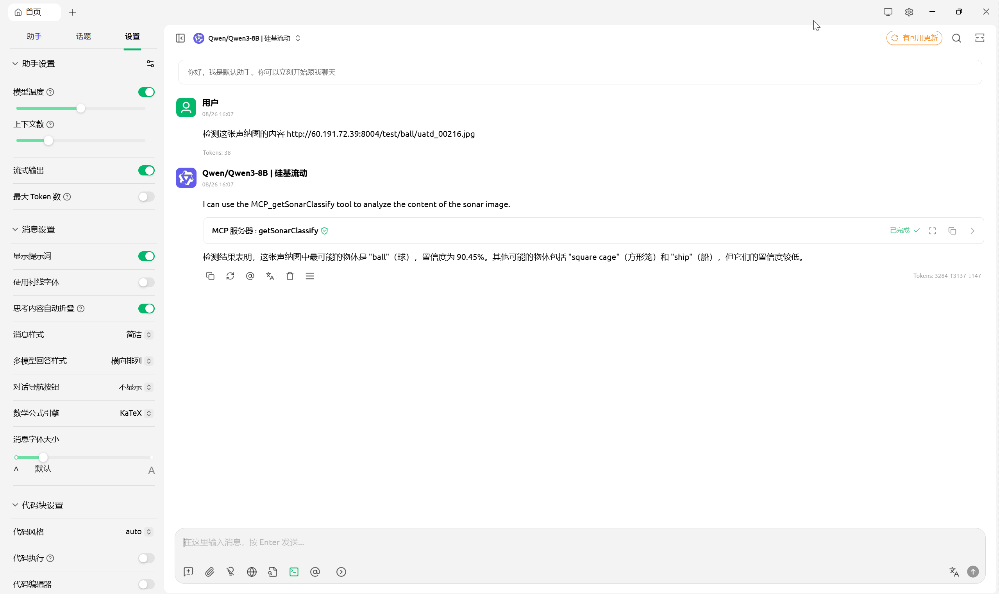
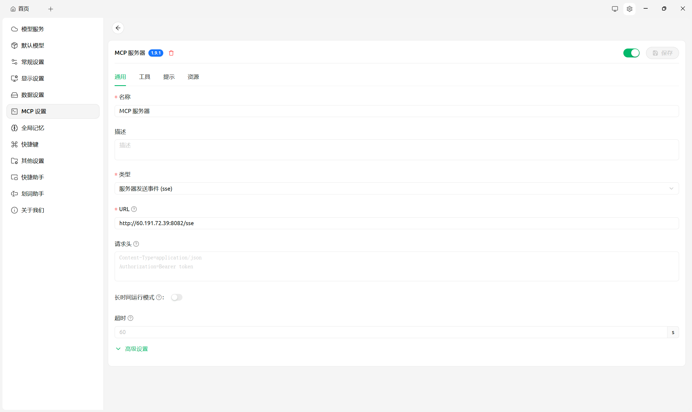
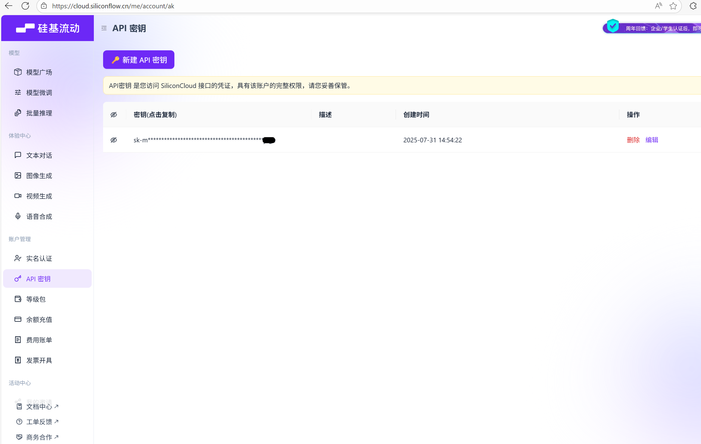
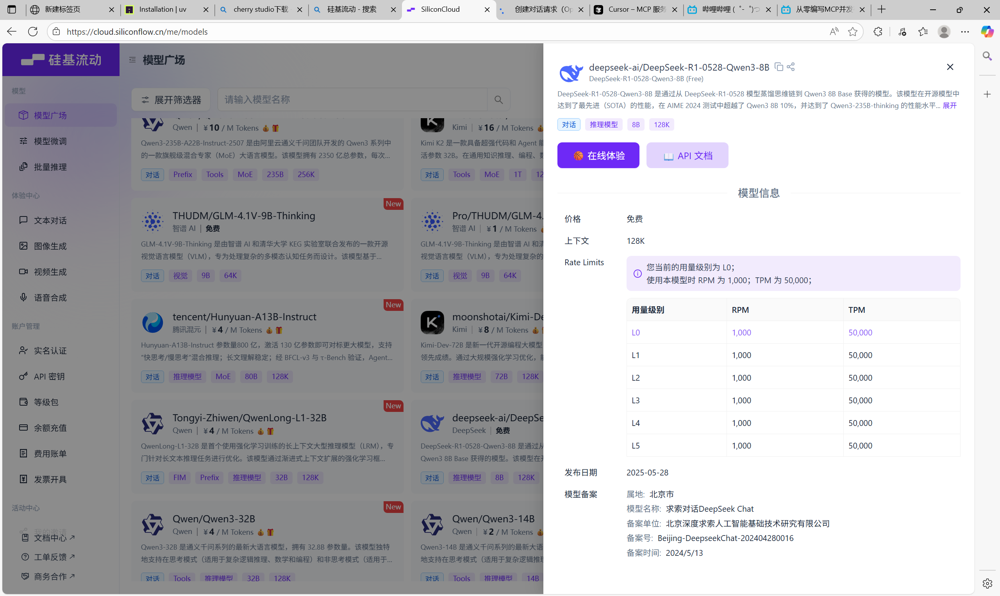
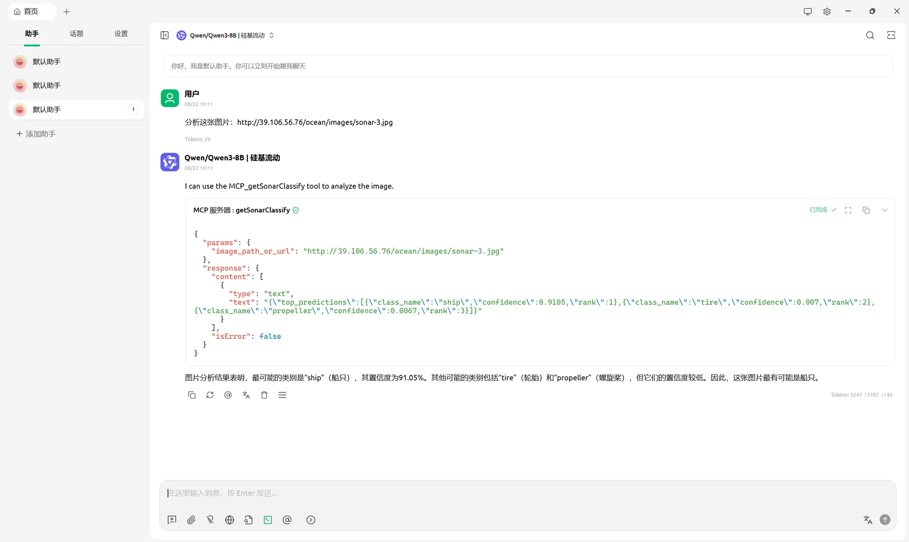
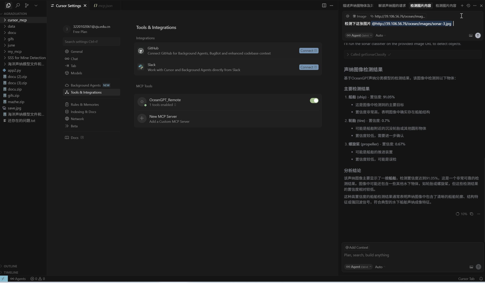
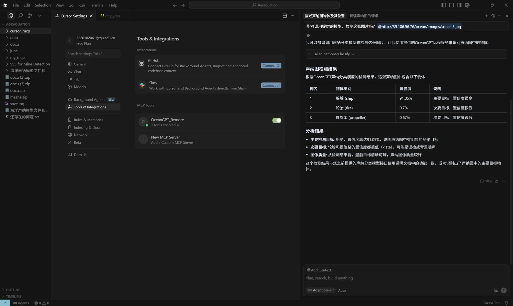
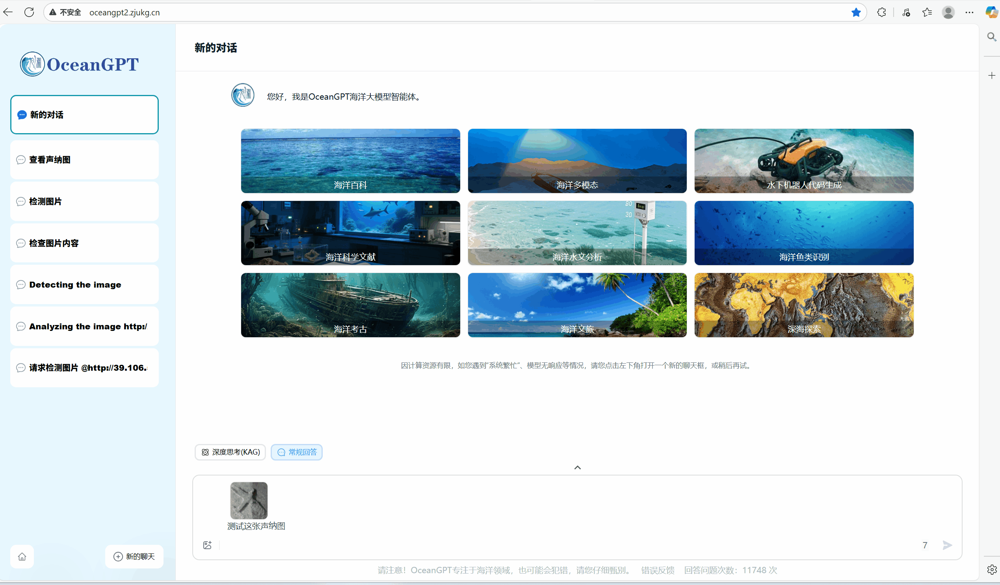
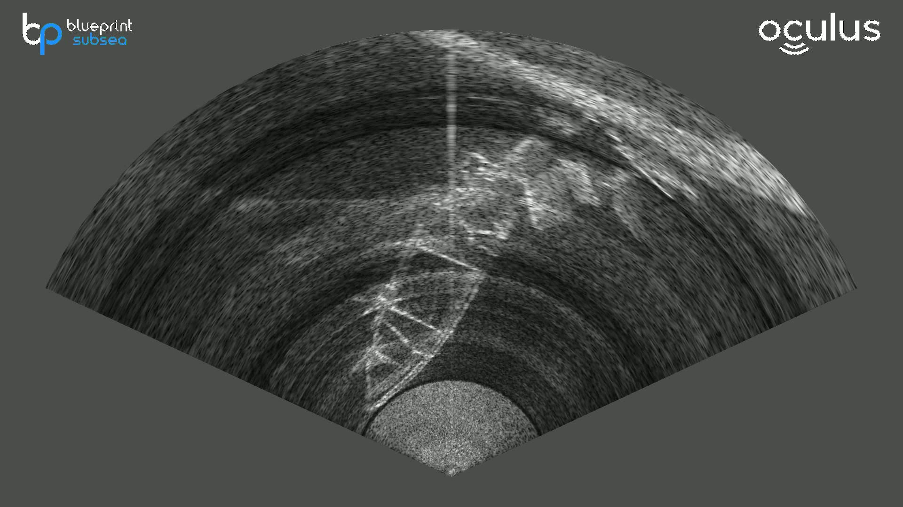
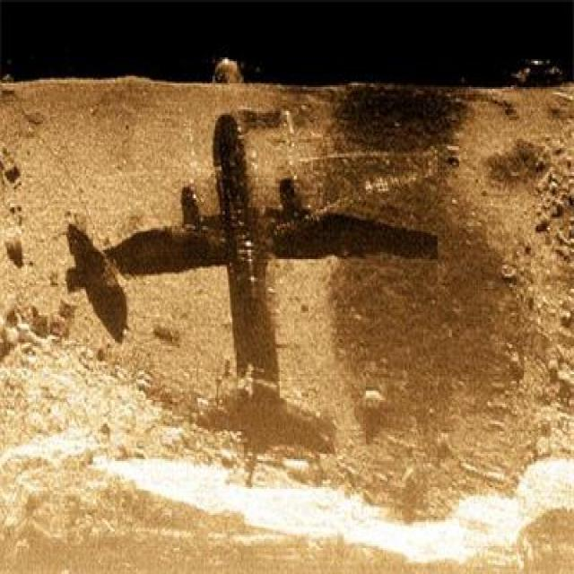

# 🌊 OceanGPT MCP Server

English | [简体中文](https://github.com/zjunlp/OceanGPT/blob/main/mcp_server/README_CN.md)

**Table of Contents**
- [🌊 OceanGPT MCP Server](#-oceangpt-mcp-server)
  - [OceanGPT Marine Perception MCP Service](#oceangpt-marine-perception-mcp-service)
  - [1. Service Functions](#1-service-functions)
  - [2. Service Usage](#2-service-usage)
    - [2.1 Using the MCP Service with Cherry Studio](#21-using-the-mcp-service-with-cherry-studio)
    - [2.2 Using the MCP Service with Cursor](#22-using-the-mcp-service-with-cursor)
    - [2.3 Experiencing Sonar Image Recognition via Online Demo](#23-experiencing-sonar-image-recognition-via-online-demo)
  - [3. Application Cases](#3-application-cases)
    - [Underwater Archaeology (Wreck Recognition)](#underwater-archaeology-wreck-recognition)
    - [Pipeline and Cable Maintenance (Pipeline Recognition)](#pipeline-and-cable-maintenance-pipeline-recognition)
    - [Aircraft Search and Rescue (Aircraft Recognition)](#aircraft-search-and-rescue-aircraft-recognition)
  - [Limitations](#limitations)
  - [Acknowledgements](#acknowledgements)

This is an experimental Model Context Protocol ([MCP](https://modelcontextprotocol.io/introduction)) server implementation for our OceanGPT. Here is an example of the remote MCP server on Cursor:

<div align="center">

</div>

# OceanGPT Marine Perception MCP Service

OceanGPT·Cangyuan has newly launched the Sonar Image **MCP (Model Context Protocol)** Service, which supports the dynamic invocation of Cangyuan Large Model's sonar image interpretation capabilities via MCP. MCP is a universal model context extension protocol, whose core function is to provide a pluggable professional service invocation mechanism for large models, enabling seamless integration of external capabilities through context protocol interfaces. In sonar image scenarios, MCP allows users to embed the sonar image analysis capabilities of the Cangyuan Model into their own large-model applications, converting raw sonar images into natural language descriptions and supporting integrated reasoning of "sonar images + text". This capability is applicable to application scenarios such as underwater environment modeling, target detection, and mission planning, enabling researchers and engineering applications to directly obtain underwater perception results through a unified conversational agent interface.

This document will introduce the Sonar Image Intelligent Recognition and Perception MCP Service and its usage from the following aspects:

- Service Functions
- Service Usage
- Application Cases

## **1. Service Functions**

MCP (Model Control Protocol) is a protocol for large-model API invocation and management. It can serve as an intermediate layer between AI and various external tool services, replacing humans to access and operate external tools, and greatly simplifying the complexity of API invocation. Based on this Sonar Image Intelligent Recognition and Perception MCP Service, users can interact with the large model in a conversational manner to achieve sonar image perception and natural language interpretation.

> MCP Service Address: http://60.191.72.39:8082/sse
> 


 

# 

This service is built on a dedicated model trained with public sonar image datasets and currently supports perception capabilities for the following 15 types of objects:

| **No.** | **Object Name (Chinese)** | **Object Name (English)** |
| --- | --- | --- |
| 0 | 球 | Ball |
| 1 | 圆形笼 | Circle Cage |
| 2 | 立方体 | Cube |
| 3 | 圆柱体 | Cylinder |
| 4 | 瓶状物 | Bottle |
| 5 | 金属桶 | Metal Bucket |
| 6 | 飞机 | Plane |
| 7 | 水下机器人 | ROV (Remotely Operated Vehicle) |
| 8 | 方形笼 | Square Cage |
| 9 | 轮胎 | Tyre |
| 10 | 船体 | Ship (Hull) |
| 11 | 钩子 | Hook |
| 12 | 螺旋桨 | Propeller |
| 13 | 气阀 | Valve |
| 14 | 水下管道 | Underwater Pipeline |

The following sections will introduce how to use this MCP Service based on Cherry Studio and Cursor.

> For MCP-related usage methods, please refer to the Bilibili video: https://www.bilibili.com/video/BV1RNTtzMENj
> 

## **2. Service Usage**

To facilitate testing, we provide the following two methods to obtain test image URLs:

1. Open the GitHub repository: https://github.com/OceanGPT/OceanGPT/tree/main/mcp_server/data. It stores images related to our training. Select the image you want to test, open it, copy the address, and replace "blob" in the address with "raw" to use it as the URL of the corresponding image. The image URLs obtained from GitHub may be unstable, so the second method is recommended.
2. Open the webpage: http://60.191.72.39:8004/. Click to open the folders until you select the image you want to test. Copy the current webpage address (e.g., http://60.191.72.39:8004/test/ball/uatd_00216.jpg) — this is the usable image URL.

### **2.1 Using the MCP Service with Cherry Studio**

Enter the image URL and put forward analysis requirements to obtain the natural language interpretation of the sonar image.


### **Usage Steps:**

1. Download uv and Python.
    - Download uv: uv is a popular Python environment management tool currently. Visit https://docs.astral.sh/uv/getting-started/installation/ to find the installation command for your corresponding system and paste it in the terminal to run.
        - For example, on Windows, open PowerShell, enter `powershell -ExecutionPolicy ByPass -c "irm https://astral.sh/uv/install.ps1 | iex"` and press Enter.
    - After installation, enter `uv python list` to check the Python version on your computer. If you want to install a specific version of Python (e.g., 3.11), enter `uv python install 3.11`. After installation, enter `uv python list` again to verify the successful installation.
2. Download the client. Visit the official website: https://docs.cherry-ai.com/cherry-studio/download. After installation, open Settings and configure the MCP Settings section.




Select "sse" as the Type, and enter our service deployment address in the URL field:

```html
http://60.191.72.39:8082/sse
```




Save configuration.

1. Next, configure the large model. Open Settings, select "Model Service", and then configure the API key and API address of the large model.


It is recommended to use Silicon Flow or Gemini to obtain the API key. Taking Silicon Flow as an example:

- Visit https://cloud.siliconflow.cn/, open "API Key" on the left sidebar, generate a new key and copy it — this is the API key.
- You also need to select the large-model service to use.


Select a suitable large-model service in the Model Plaza.




Click to open the "API Documentation", copy the URL (note: do not copy the entire content), and paste it back into the "API Address" field in Cherry Studio.




4. If you are using Cherry Studio for the first time, you may need to install its built-in tools such as uv. Click the red exclamation mark in the upper right corner to complete the installation. Then, open the chat window and select the configured service.


5. Enter the image URL and request detection. The system will start invoking the model to detect the image and return the result.



### **2.2 Using the MCP Service with Cursor**



Provide the image URL and detection requirements in the chat window on the right. Press Enter, and the system will start invoking the service for processing.


1. Download the Cursor client: https://docs.cursor.com/zh/tools/mcp.
2. After downloading, open the client, click "Settings" on the right, search for "MCP Tool" and configure it (the small green dot indicates successful configuration).


Configuration details: Use the service URL we provide for the "url" field: http://60.191.72.39:8082/sse.


```json
{
  "mcpServers": {
    "OceanGPT_Remote": {
      "url": "<http://60.191.72.39:8082/sse>"
    }
  }
}
```

1. After configuration, open any folder — the "Chat" panel will appear on the right. At this point, you can enter the URL and commands like you do in Cherry to invoke our service for image detection. 

Click "Run Tool" to obtain the detection result, which is similar to the result obtained using Cherry Studio.




### **2.3 Experiencing Sonar Image Recognition and Perception via the Online Demo System**

Open the online service URL: http://oceangpt2.zjukg.cn/ to experience sonar image recognition and perception.

> **Note**: Due to limited computing resources, the online system currently uses a small-scale model, which may result in incomplete target recognition or deviations in results. It is recommended that you include the keyword "sonar image" in your input prompt to help improve recognition accuracy and performance. If the system is busy or unresponsive temporarily, you can click the bottom-left corner of the interface to open a new chat window, or try again later.
> 




You can also use open-source MCP client tools to call this service, such as: https://github.com/chrishayuk/mcp-cli, etc.

## **3. Application Cases**

The target types currently supported by this service can support the following application scenarios:

> The URL below each sample image can be copied and directly used to test the above-mentioned detection service.
> 

### **Underwater Archaeology (Wreck Recognition)**




> URL of this image: http://60.191.72.39:8004/test/ship/CB9.jpg
> 

### **Pipeline and Cable Maintenance (Pipeline Recognition)**


> URL of this image: http://60.191.72.39:8004/test/pipeline/b_GL105.jpg
> 

### **Aircraft Search and Rescue (Aircraft Recognition)**



> URL of this image: http://60.191.72.39:8004/train/plane/sctd_000040.jpg
> 

## **Limitations**

Due to the limited training data, this service may have errors and cannot currently recognize types beyond the existing categories. We will continuously optimize the model and gradually improve its capabilities.

## **Acknowledgements**

Part of the marine sonar data used in the training of this experiment is selected from the following repositories or organizations:

- https://github.com/MingqiangNing/SCTD
- https://www.kaggle.com/datasets/enochkwatehdongbo/seabedobjects-klsg-dataset
- https://openi.pcl.ac.cn/OpenOrcinus_orca/URPC2021_sonar_images_dataset

**This service is jointly completed by Ma Zhe, Deng Hongjie, Ru Xiangyuan, Zhao Yanqiu, etc. We would like to express our gratitude to them.**

**For problem feedback, please submit an issue to: https://github.com/OceanGPT/OceanGPT or send an email to: zhangningyu@zju.edu.cn**
