# OceanGPT MCP 用户手册

[English](https://github.com/zjunlp/OceanGPT/blob/main/mcp_server/README.md) | 简体中文


**目录**
[English](https://github.com/zjunlp/OceanGPT/blob/main/mcp_server/README.md) | 简体中文

**目录**
- [OceanGPT MCP 用户手册](#oceangpt-mcp-用户手册)
  - [一、服务功能](#一服务功能)
  - [二、服务使用](#二服务使用)
  - [2.1 基于Cherry Studio 使用MCP服务](#21-基于cherry-studio-使用mcp服务)
    - [使用方法：](#使用方法)
  - [2.2 使用 Cursor 使用MCP服务](#22-使用-cursor-使用mcp服务)
  - [2.3 在线演示系统体验声呐图识别感知](#23-在线演示系统体验声呐图识别感知)
  - [三、应用案例](#三应用案例)
  - [水下考古（沉船识别）](#水下考古沉船识别)
  - [管缆运维（管道识别）](#管缆运维管道识别)
  - [飞行器搜救（飞机识别）](#飞行器搜救飞机识别)
  - [](#)
  - [局限](#局限)
  - [致谢](#致谢)


**OceanGPT·沧渊**新增声呐图像 **MCP（Model Context Protocol）**服务，支持利用MCP动态调用沧渊大模型的声纳图像解读能力。MCP 是一种通用模型上下文扩展协议，其核心作用是为大模型提供可插拔的专业服务调用机制，通过上下文协议接口完成外部能力的无缝接入。在声呐图像场景下，MCP 允许用户在自己的大模型应用程序中植入沧渊模型的声呐图像解析能力，将原始声呐图像转化为自然语言形式的描述，并支持实现“声纳图像+语言文字"的一体化推理。该能力适用于水下环境建模、目标探测、任务规划等应用场景，使科研人员与工程应用能够通过统一的对话式智能体接口直接获取水下感知结果。

本文档将从下面几个方面介绍声呐图智能识别感知MCP服务以及其使用方法：

- 服务功能
- 服务使用
- 应用案例

---

## 一、服务功能

MCP (Model Control Protocol)是一种用于大模型API调用和管理的协议,可以作为AI与各种外部工具服务的中间层，代替人类访问并操作外部工具，大幅简化了API调用的复杂性。基于本声呐图智能识别感知MCP服务，可以以对话的方式与大模型进行交互，实现声呐图的感知和自然语言解读。

> 本MCP服务地址: **http://60.191.72.39:8082/sse**
> 

> 本MCP服务使用文档：**https://github.com/OceanGPT/OceanGPT/blob/main/mcp_server/README_CN.md**
> 

该服务基于公开的声纳图数据集训练得到专有模型，目前支持如下15类物体的感知能力：

| 编号 | 物体中文名 | 物体英文名 |
| --- | --- | --- |
| 0 | 球 | ball |
| 1 | 圆形笼 | circle cage |
| 2 | 立方体 | cube |
| 3 | 圆柱体 | cylinder |
| 4 | 瓶状物 | bottle |
| 5 | 金属桶 | metal bucket |
| 6 | 飞机 | plane |
| 7 | 水下机器人 | rov |
| 8 | 方形笼 | square cage |
| 9 | 轮胎 | tyre |
| 10 | 船体 | ship |
| 11 | 钩子 | hook |
| 12 | 螺旋桨 | propeller |
| 13 | 气阀 | valve |
| 14 | 水下管道 |  pipeline |

下面我们将介绍基于Cherry Studio 和Cursor使用本MCP服务。

> mcp相关的使用方法可以参考B站视频 https://www.bilibili.com/video/BV1RNTtzMENj
> 

## 二、服务使用

为了方便大家测试，我们提供以下两种方式来获取测试图片url

1.   打开github仓库：https://[github.com/OceanGPT/OceanGPT/tree/main/mcp_server/data](http://github.com/OceanGPT/OceanGPT/tree/main/mcp_server/data) ，存储有我们训练相关的图片，可择想要测试的图片，打开后复制地址，将地址中的bbob改为raw即可作为对应图片的url使用。从github上获取的图片url可能不太稳定，推荐使用第二种方法
2. 打开网页   http://60.191.72.39:8004/  ，点击打开其中文件夹，直到选择了想要测试的图片。复制此时的网页地址例如   http://60.191.72.39:8004/test/ball/uatd_00216.jpg   ，这就是可以使用的图片url。

## 2.1 基于Cherry Studio 使用MCP服务

输入图片的url地址并提出分析要求就可以获取声呐图的自然语言解读

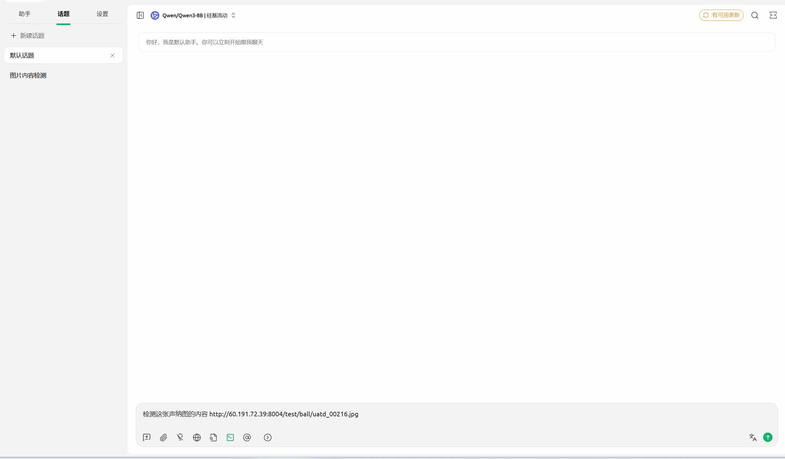

### 使用方法：

1.  下载uv和python。

- 下载uv，uv是目前热度较高的python环境管理工具: https://docs.astral.sh/uv/getting-started/installation/
在这个网址中找到对应系统的安装命令，在终端中粘贴启用。
- 例如windows中需要打开powershell,输入`powershell -ExecutionPolicy ByPass -c "irm <https://astral.sh/uv/install.ps1> | iex"` 并回车
安装完成后，输入`uv python list`检查电脑上的python版本。
- 如果想要安装某个版本的python(比如3.11)可以输入`uv python install 3.11`，安装完成后输入`uv python list`检查是否安装成功。

1.  下载客户端。官网 https://docs.cherry-ai.com/cherry-studio/download
完成安装后，打开设置，在MCP设置一栏进行配置

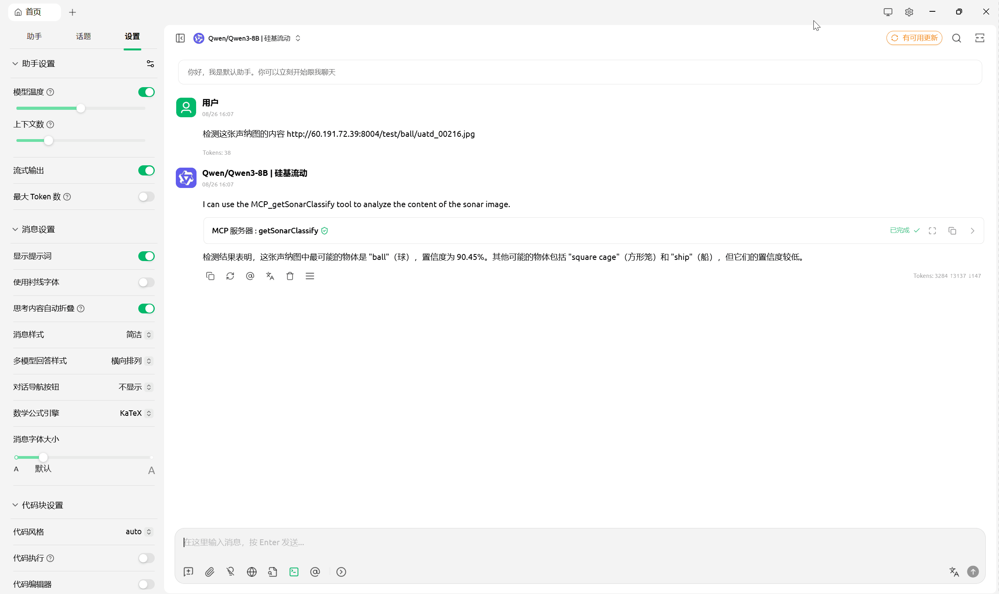

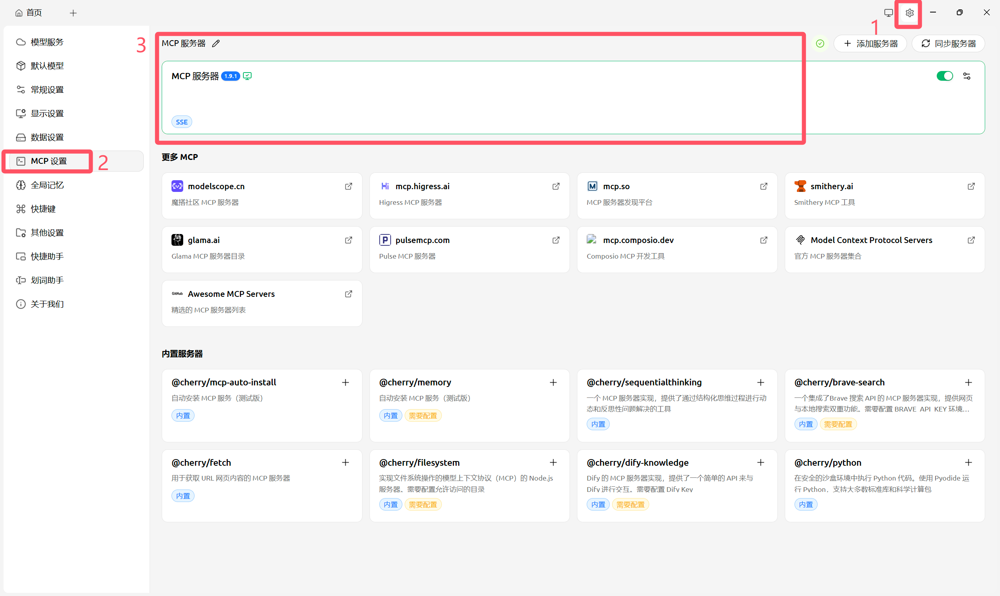

类型选择sse，URL输入我们服务部署的地址

```
http://60.191.72.39:8082/sse
```


点击保存。

1. 接下来配置大模型。打开设置，选择模型服务，接下来要对大模型的API密钥和API地址进行配置。

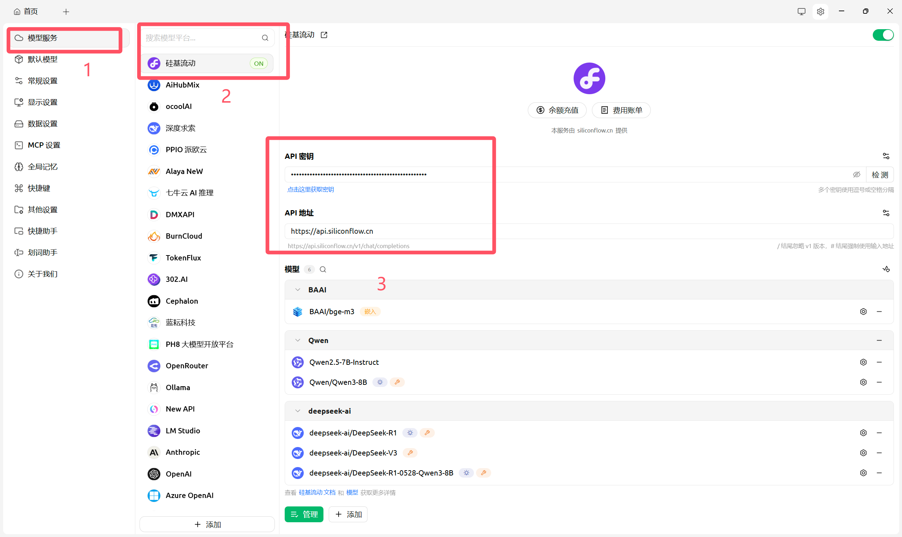

获取API密钥推荐使用硅基流动或者gemini。以硅基流动为例，打开 https://cloud.siliconflow.cn/ ，打开左侧API密钥，生成一个新的密钥并复制。这就是API密钥，还需要选择使用的大模型服务

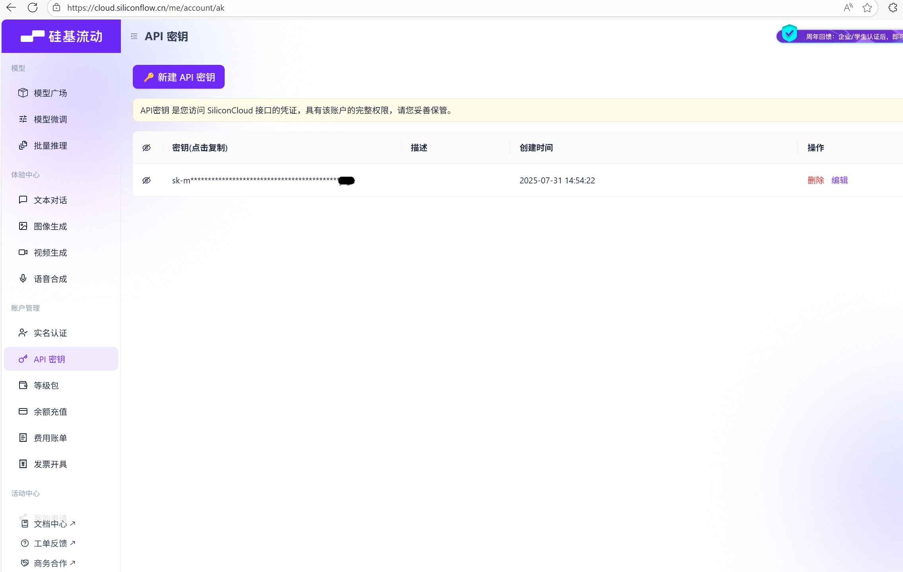

在模型广场中选择合适的大模型服务

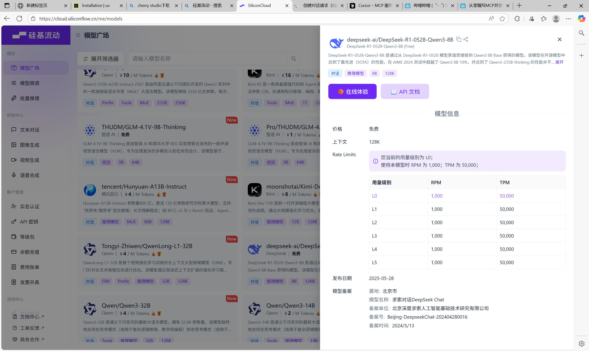

点击打开 API文档，复制url后面的网址（注意不要全部复制），并粘贴回cherry studio的API地址

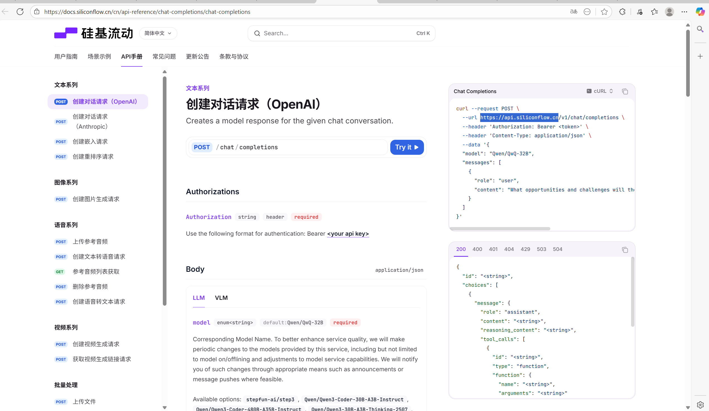

1. 如果是第一次使用cherry studio,可能需要安装其内置的uv等，点击右上角红色感叹号完成安装以后，就可以打开对话框，选中配置好的服务

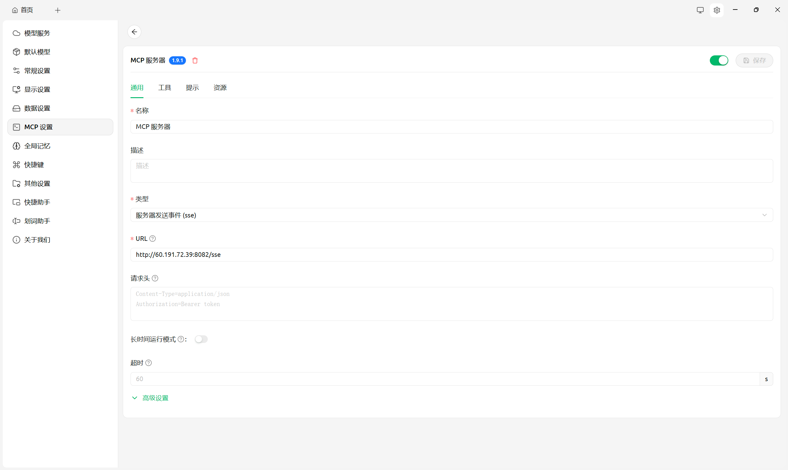

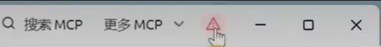

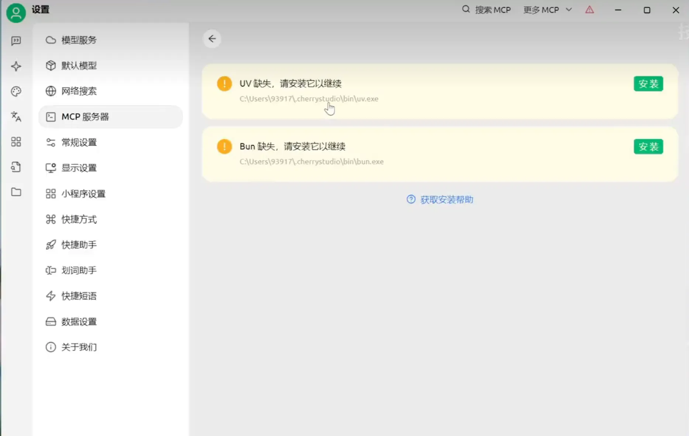


1. 然后输入图片的url并要求其检测，就会开始调用模型对图片进行检测并返回结果。

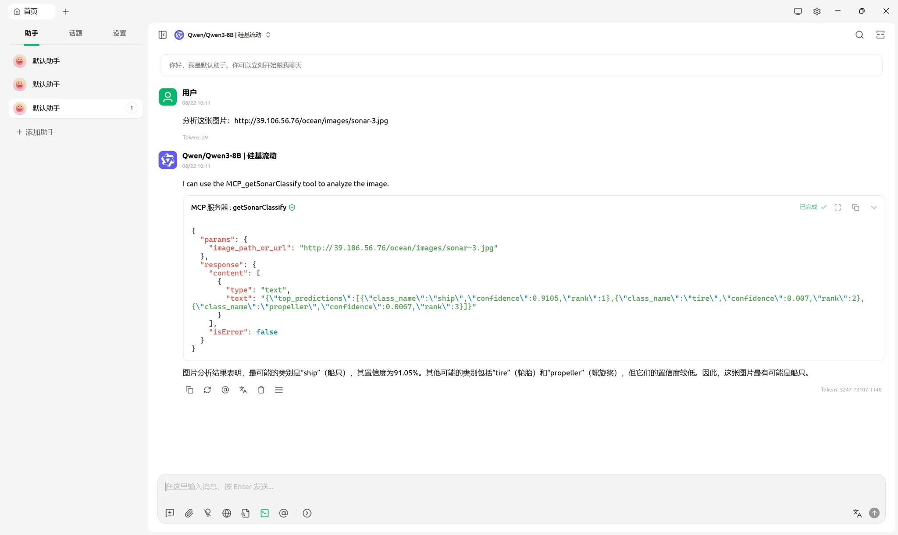

## 2.2 使用 Cursor 使用MCP服务

在右侧对话窗口提供图片url和检测要求，回车后就会开始调用服务并处理

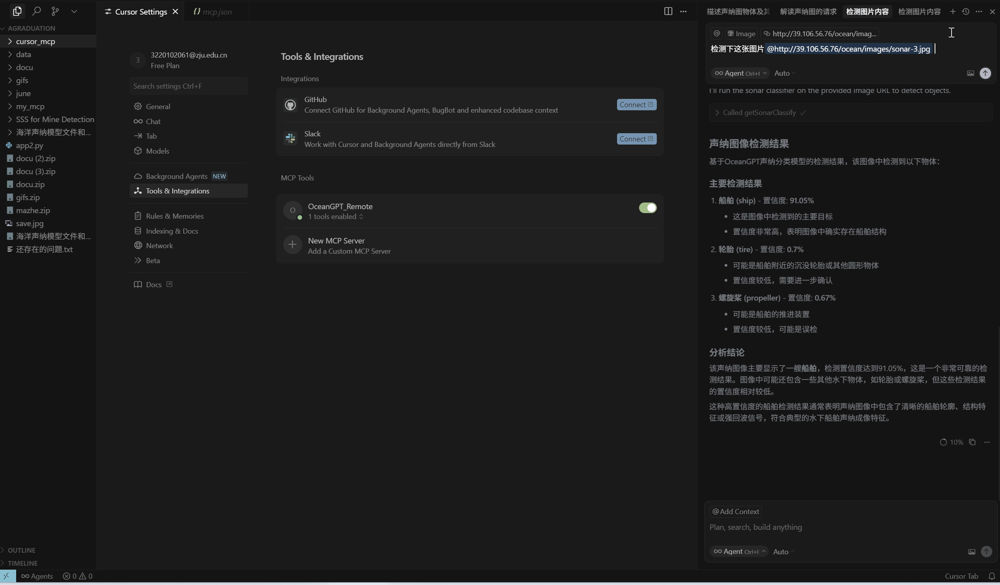

1. 下载cursor客户端 https://docs.cursor.com/zh/tools/mcp
2. 完成下载后，打开客户端点击右侧设置，搜索mcp tool进行配置(这个小绿点代表配置成功)

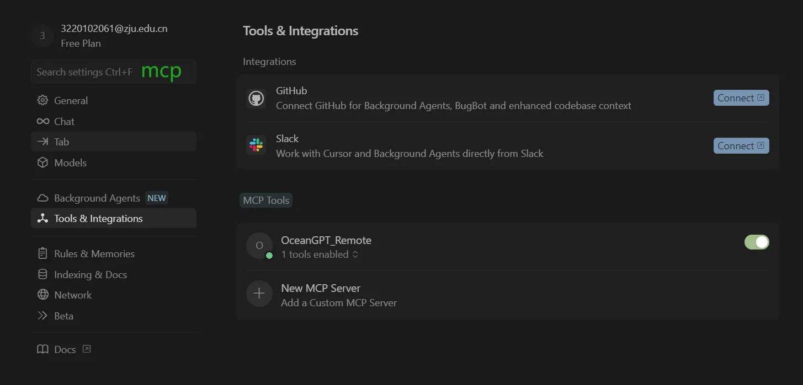

配置内容如下：url使用我们提供服务的url： http://60.191.72.39:8082/sse


```
{
  "mcpServers": {
    "OceanGPT_Remote": {
      "url": "<http://60.191.72.39:8082/sse>"
    }
  }
}

```

1. 配置完成后打开任意文件夹，右侧出现chat栏。这时就可以像使用cherry那样输入url和命令，调用我们的服务来检测图片了

点击Run tool，即可获取检测结果，返回结果与使用cherry studio类似

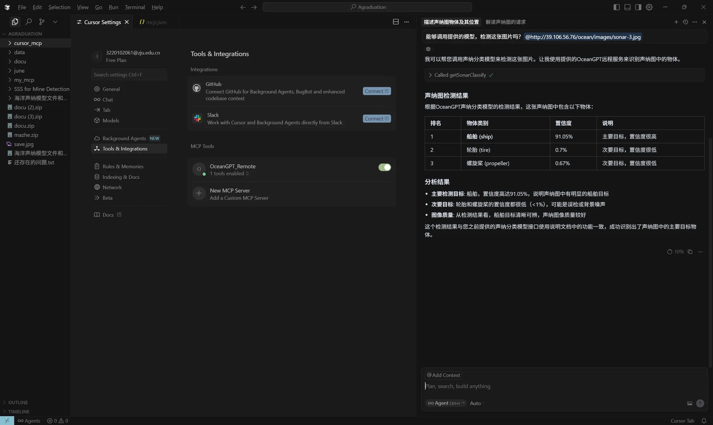

## 2.3 在线演示系统体验声呐图识别感知

打开在线服务网址：http://oceangpt2.zjukg.cn/ 即可以体验声呐图识别感知。

> **提示**：由于计算资源有限，在线系统当前采用小模型，可能存在目标识别不全或结果偏差的情况。建议您在输入提示（Prompt）时加入“声纳图”关键词，以帮助提升识别准确率与效果。如遇系统繁忙或暂时无响应，您可点击界面左下角开启新对话窗口，或稍后再次尝试。
> 

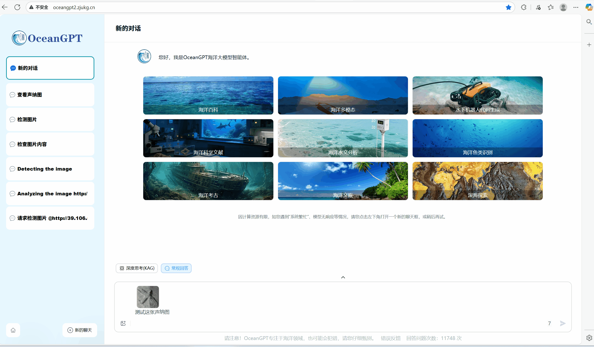

 您还可以使用开源的MCP客户端工具调用本服务，如：https://github.com/chrishayuk/mcp-cli 等。

## 三、应用案例

本服务目前支持的目标类型可以支撑以下应用场景：

<aside>
💡

示例图片下方的url地址可复制，直接用于测试上述检测服务

</aside>

## 水下考古（沉船识别）

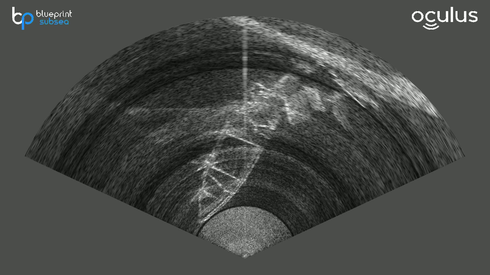

<aside>
💡

此图url:   http://60.191.72.39:8004/test/ship/CB9.jpg

</aside>

## 管缆运维（管道识别）

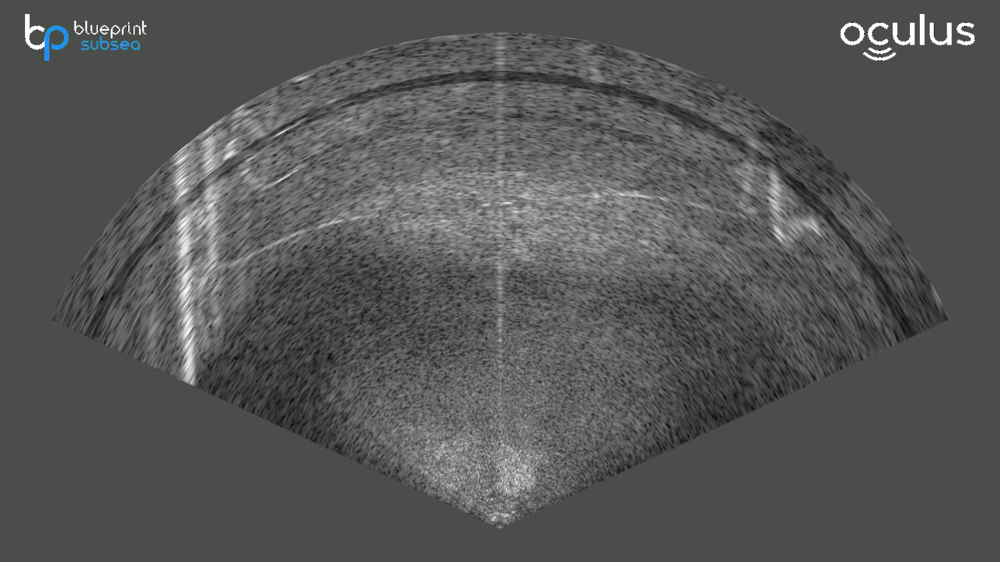

<aside>
💡

此图url:   http://60.191.72.39:8004/test/pipeline/b_GL105.jpg

</aside>

## 飞行器搜救（飞机识别）

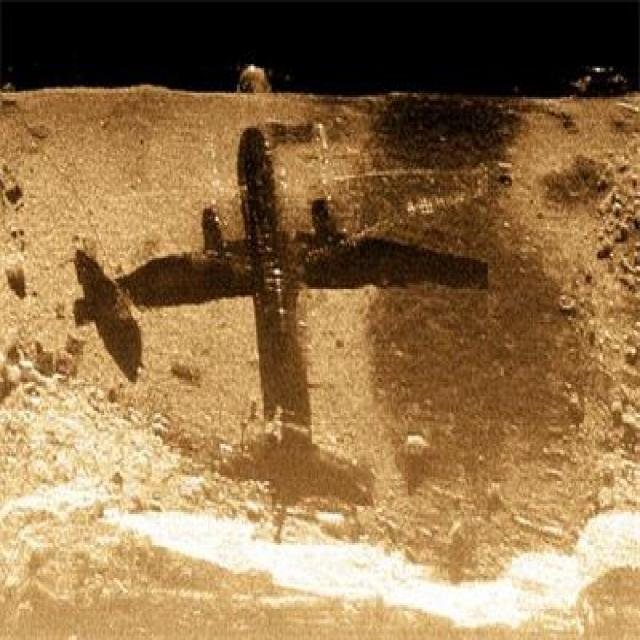

<aside>
💡

此图url:   http://60.191.72.39:8004/train/plane/sctd_000040.jpg

</aside>

## 

## 局限

本服务由于训练数据有限，可能存在错误，并且暂时无法识别超出既有类别的类型。我们将持续优化模型，逐步提升其能力。

## 致谢

本次实验训练用到的部分海洋声纳数据选自如下仓库或团体：https://github.com/MingqiangNing/SCTD  ，https://www.kaggle.com/datasets/enochkwatehdongbo/seabedobjects-klsg-dataset ，https://openi.pcl.ac.cn/OpenOrcinus_orca/URPC2021_sonar_images_dataset

**本服务由马哲、邓鸿杰、茹湘原、赵延秋等协力完成，特此致谢。**

**问题反馈，请提交 issue 至：https://github.com/OceanGPT/OceanGPT或者邮箱：zhangningyu@zju.edu.cn**
